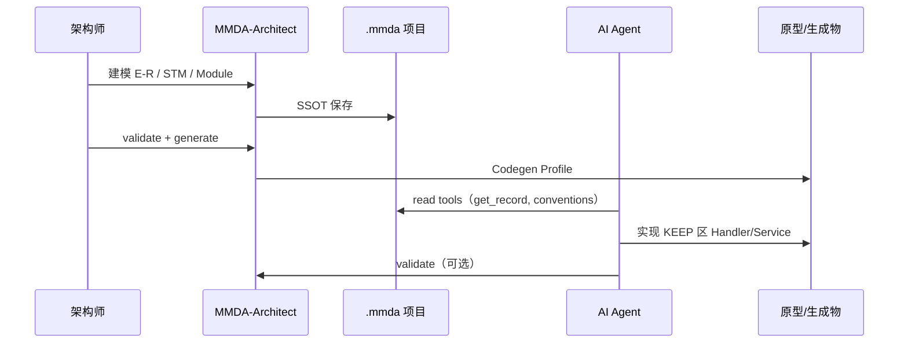

# Vibe & Spec 编程

**Vibe & Spec** 指：架构师在 MMDA-Architect 中完成**规格化设计**（Spec），将项目导出为 AI 可读包，由 Agent 在规范与 KEEP 边界内**实现**（Vibe）。

## 1. 流程



## 2. Spec 导出包

Architect 可导出 `spec-pack/` 供 AI 一次性阅读：

```
spec-pack/
├── manifest.json
├── conventions.md
├── modules-tree.md          # 自动生成的模块树说明
├── models/                  # 全部 .mmda（Legacy M语言）
├── actions-summary.md       # Action + statusTransition 表
├── events-summary.md
└── codegen-report.md        # 最近生成清单
```

命令（规划）：`mmda export spec-pack -o ./spec-pack`

## 3. conventions.md 模板

项目根 `conventions.md` 应定义：

```markdown
# 项目约定

## 分层
- models/：MMDA 生成，禁止手改
- handlers/：AI 与工程师实现 Action/Handler
- tests/：集成测试

## 命名
- 实体：PascalCase，与 Record 名一致
- API 路径：与 moduleUrl 一致

## Action 实现
- 每个 @Action 对应 handlers/{ModuleCode}/{ActionName}.handler.*
- 必须校验 statusTransition 前置状态

## 禁止
- 修改 generated/ 下 GENERATED 区
- 绕过元模型新增未声明字段
```

## 4. AI 指令示例（给 Cursor）

```
你是 MES 项目助手。先调用 mmda_get_conventions 和 mmda_get_record mes.ProductionOrder。
在 handlers/M.03.001/ 实现 breakDown Action：
- 仅当 status 为 NEW 时可执行
- 分解逻辑写入 KEEP 区
- 完成后运行 mmda_project_validate
```

## 5. Spec 完成度检查清单

- [ ] Module 树覆盖所有 Feature
- [ ] 核心 Record 有 E-R 关系与主键
- [ ] 生命周期实体有 STM（@State + Action）
- [ ] validate 零 error
- [ ] 至少一个 Codegen Profile 生成成功
- [ ] conventions.md 已填写
- [ ] `.cursor/rules` 已配置

## 6. 与 M语言 的关系

Spec 的权威表示是 **`.mmda` + M语言**，不是 Word/Draw.io 孤立文档。  
Draw.io 等可作附件，但必须回写到 SSOT。

## 7. 相关

- [tools.md](tools.md)
- [../project.md](../project.md)
- [../readme.md](../readme.md)
