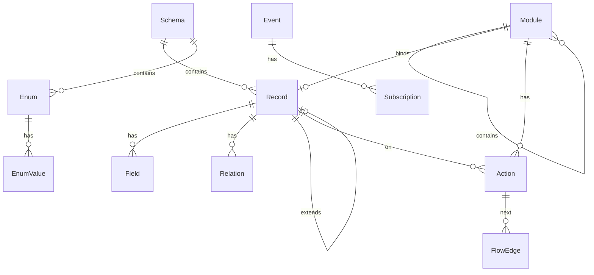

# 元模型规范

元模型是 MMDA 的**语言无关逻辑层**。可序列化为 JSON/YAML、存入关系库、或投影为 M语言。  
本文定义逻辑元素；Legacy MySQL 表名映射见 [legacy/java-factory.md](../legacy/java-factory.md)。

## 1. 总体结构



## 2. Schema（逻辑库）

对应业务域的数据边界，如 `base`、`mes`、`wms`。

| 属性 | 类型 | 说明 |
|------|------|------|
| `schemaCode` | string | 唯一标识，如 `mes` |
| `displayLabel` | string | 显示名 |
| `systemCode` | char(1) | 子系统编码字母，如 `M` |
| `namespace` | string | 生成代码的命名空间 |
| `description` | string | 说明 |

## 3. Record（元对象 / MetaObject）

实体或视图的定义。

| 属性 | 类型 | 说明 |
|------|------|------|
| `schemaCode` | string | 所属 Schema |
| `name` | string | 对象名，如 `ProductionOrder` |
| `displayLabel` | string | 显示名 |
| `objType` | enum | `T` \| `V` \| `TA` \| `TAF` \| `VAF` |
| `uniqueKey` | string? | 业务唯一字段名 |
| `nameCol` | string? | 显示名称字段 |
| `partitionKey` | string? | 分区主键字段名（`@PartitionID` 所在列） |
| `minID` | int? | 分区 realId 下限；空 = 字段类型默认最小值 |
| `maxID` | int? | 分区 realId 上限；空 = 字段类型默认最大值 |
| `parentIdCol` | string? | 树形父键 |
| `superName` | string? | 继承基类 Record |
| `extendType` | enum | `NONE` \| `EXTENDS` \| `INHERITS` |
| `fixedFilter` | string? | 子类型/视图固定过滤 |
| `description` | string? | 文档 |

### objType 语义

| objType | 能力 |
|---------|------|
| T | 持久化实体 |
| V | 只读视图 |
| TA | 实体 + ModuleAction |
| TAF | 实体 + Action + FlowTrail/流程 |
| VAF | 视图 + Action + Flow |

**多租户（可选）**：`partitionKey` 指向带 `@PartitionID` 的主键列；完整 ID 高 16 位为 tenantId、低 48 位为 realId。`minID`/`maxID` 约束 realId 范围，与 M 语言范围语法互转（见 [records.md](../../../lang/records.md)）。

## 4. Field（元列 / MetaCol）

| 属性 | 类型 | 说明 |
|------|------|------|
| `name` | string | 字段名 |
| `displayLabel` | string | 显示名 |
| `dataType` | DataTypeRef | 逻辑类型 |
| `nullable` | bool | 是否可空 |
| `isKey` | bool | 主键成员 |
| `isGenerated` | bool | 自增/生成 |
| `maxLength` | int? | 字符串长度 |
| `precision` / `scale` | int? | 小数精度 |
| `unsigned` | bool | 无符号 |
| `defaultVal` | string? | 默认值表达式 |
| `computed` | bool | 是否计算列 |
| `formula` | string? | 计算公式 |
| `constraint` | string? | 检查约束；可编码 `positive`/`future`/`indexed` 等 M 语言限制 |
| `readOnly` | bool | 只读 |
| `fieldRef` | FieldRef? | 枚举/关系 DSL（见下） |
| `groupLabel` | string? | UI 表单分组（如 `a1`、`s9`） |
| `listed` | bool | 列表默认显示 |
| `filterable` | bool | 可过滤 |
| `hidden` | bool | UI 默认隐藏；关联外键 `hidden` → `@One` 默认 **lazy** |
| `colIndex` | int | 排序 |
| `partitionID` | string? | 已废弃；使用 Record.`partitionKey` + `minID`/`maxID` |
| `uniqueKey` | bool | 分区内业务唯一（`@Unique`） |
| `nameCol` | bool | 默认显示名列（`@Name`） |
| `thumbnailCol` | bool | 缩略图列（`@Thumbnail`） |

### M 语言限制关键字（Field modifiers）

| M 语言 | MetaCol / 库表 |
|--------|----------------|
| `indexed` | 索引（或 `constraint`） |
| `unique` | DB 唯一（`constraint`）；`@Unique` 为 `uniqueKey` 业务语义 |
| `identity` / `generated` | `isKey` + 单主键 `*Id`，或 `isGenerated` |
| `default` | `defaultVal`（`current_timestamp()` → `now`） |
| `charset` | `dataType`（`char`→`ascii`，`nvarchar`→`utf`） |
| `unsigned` | `isUnsigned` |
| `positive` / `negative` / `future` / `past` | `constraint` |
| `readonly` | `readOnly`；`@Computed` 恒只读 |
| `hidden` | `hidden`；`hidden` + `@One` → 默认 lazy |
| `?` 可空 | `nullable` |

### 对象级约束（M语言）

| M 语言 | 说明 |
|--------|------|
| `@Id (cols…)` / `@Id PK_tablename(cols…)` | 组合主键 |
| `@Index IDX_…(cols…)` / `… unique` | 索引 / 唯一索引（落库） |
| `@ForeignKey FK_…(cols) ref Entity(cols)` | 外键；`onUpdate` / `onDelete` 映射 referential action |
| `@Check CHK_…(expr)` | 检查约束 |

字段 `@Unique` → `uniqueKey`（业务校验，**不**落库）。存储唯一 → `@Index … unique`。

**DB 对象前缀**（逆向自 `information_schema`）：`PK_`、`FK_`、`IDX_`、`CHK_`、`PROC_`、`FUN_`、`TRG_`。

### 字段注解（M语言）

| 注解 | 存储 / enumSet 等价 | 说明 |
|------|---------------------|------|
| `@One Entity(cols…) as alias` | `HAS_ONE …(cols…) AS alias` | 一对一导航；引用整实体，cols 首列主键、其余显示列 |
| `@Ref Entity(cols…)` | `REF …(cols…)` | 外键 + 显示列，无导航 |
| `@Many` | `MetaRelation` | 一对多 |
| `@State Stm` | 状态列 + STM | 枚举字段 + 状态机名 |
| `@Computed` | `computed` + `formula` | 计算列 |
| `@PartitionID range` | `partitionKey` + `minID` / `maxID` | 分区 realId 范围 |
| `@Unique` | `uniqueKey`（列级） | 分区内业务唯一编码 |
| `@Name` | `nameCol` | 默认显示名（可多个） |
| `@Thumbnail` | `thumbnailCol` | 列表缩略图（唯一） |

Legacy FieldRef DSL（`metacol.enumSet`，逆向时映射为注解）：

```
ENUM OrderStatus
ENUMS PartnerRole
REF User(userID, userName)
HAS_ONE Partner(partnerID, partnerCode, partnerName) AS customer
```

解析规则：

- `@One` / `@Ref` / Legacy `REF` / `HAS_ONE` → `Relation`（joinOn: `remoteKey=@localKey`）
- `@Many` → `MetaRelation` 或集合字段
- `ENUM` / `ENUMS` → 引用 `Enum`；`ENUMS` 表示 BitSet

### @One 与 @Ref

关联字段列表 `Entity(col1,col2,…)`：**col1** 为对方主键（join 本 record 外键），**col2…** 为默认显示列。`@One` 与 `@Ref` 语法相同；`@One` 仍加载完整导航实体，括号内列约束 UI 投影。

| | @Ref | @One |
|---|-----|------|
| 语义 | 外键 + 显示用值对象 | 一对一导航实体（整实体） |
| 导航属性 | 无 | 有（如 `Order.customer`） |
| 字段列表 | 主键 + 显示列 | 主键 + 默认显示列（可选） |
| 典型 UI | dropdown | searchBox |
| API | ID + 显示标签 | 嵌套对象属性 |
| 加载策略 | — | 注解尾 `eager`/`lazy`；默认 `@One` eager、`@Many` lazy、`@Ref` eager；`hidden` 外键 `@One` → lazy |

Runtime 序列化示例见 [legacy/runtime-java.md](../legacy/runtime-java.md#api-序列化ref--has_one)。

## 5. Relation（元关系 / MetaRelation）

显式一对多导航（`@Many` 的存储形式）。

| 属性 | 说明 |
|------|------|
| `name` | 关系名，如 `items` |
| `relationType` | `HAS_MANY` 等 |
| `relativeRecord` | 子实体 |
| `joinOn` | 连接条件 |
| `canHave` | 子类型条件表达式 |
| `fetchMode` | 加载策略；M 语言 `@One`/`@Many`/`@Ref` 尾部的 `eager`/`lazy` |
| `defaultFilter` / `defaultSort` | 默认查询 |

## 6. Enum

| 属性 | 说明 |
|------|------|
| `name` | 如 `OrderStatus` |
| `baseType` | `int` \| `BitSet` |
| `bitwise` | 是否位标志 |
| `values` | `{ code, value, label }[]` |

文本格式：`0;NEW;新|1;PAYED;已付款`

## 7. View

基于 Record 的投影，含 join 与 field 列表。见 [language/records.md](../../../lang/records.md)。

## 8. Module（功能架构）

| 属性 | 说明 |
|------|------|
| `moduleCode` | 层级编码，如 `M.03.001` |
| `moduleLabel` | 显示名 |
| `moduleType` | `0` Subsystem / `1` Module / `2` Feature |
| `schemaCode` | 关联 Schema |
| `recordRef` | Feature 绑定的 Record（type=2 时） |
| `moduleUrl` | 路由/入口路径 |
| `allowOps` | 操作权限位掩码 |
| `defaultFilter` / `defaultSort` | 列表默认 |

## 9. Action（ModuleAction）

| 属性 | 说明 |
|------|------|
| `moduleCode` | 所属 Feature |
| `actionName` | 机器名，如 `approve` |
| `displayLabel` | 按钮标签 |
| `statusTransition` | 状态转移 DSL |
| `executableExpression` | 前置条件 |
| `incomingTokensRequired` | 流程 token 数 |
| `promptType` | 交互提示类型 |
| `description` | 说明 |

### statusTransition DSL

```
NEW=>APPROVED                    # 单源单目标
NEW,DRAFT=>USED                  # 多源单目标
*=>ABANDONED                      # 任意源
!(FINISHED,CANCELED)=>CANCELED   # 否定条件
NEW=>NEW                           # 不改变状态
```

## 10. FlowEdge（ModuleFlow）

| 属性 | 说明 |
|------|------|
| `flowCode` | 流程标识 |
| `actionCode` | 当前 Action |
| `nextActionCode` | 后继 Action |
| `importance` / `urgency` | 优先级 |
| `sopDuration` | 标准工时（分钟） |
| `multiplicity` | 并发度 |
| `fallback` | 是否回退边 |

## 11. Event 与 Subscription

见 [events/language.md](../events/language.md)。

## 12. UiField（呈现层，可选）

与 Field 分离的 UI 元数据。Field 上的 `groupLabel`、`listed` 等管列表/分组；UiField 管 formatter、editor、renderer。  
详见 [metadata/ui-field.md](../metadata/ui-field.md)。

## 13. Design Change Log

| 属性 | 说明 |
|------|------|
| `logId` | 递增 ID |
| `timestamp` | 时间 |
| `eventType` | 如 `RecordAdded`、`FieldRenamed` |
| `refName` | 对象类型 |
| `refKey` | 对象键 |
| `difference` | JSON Patch 或自定义 diff |
| `prevLogId` | 链表 |
| `undone` | 是否已撤销 |

**注意**：Design Change Log ≠ Domain Event Sourcing。

## 14. 实体能力推断（Codegen 约定）

Codegen Profile 可根据 Field 组合推断实体能力（非元模型硬约束）：

| 条件 | 推断能力 |
|------|----------|
| 有 `status` 枚举 + `ownerID` + `partitionKey` | Flowable（可审计状态机） |
| 有 `creatorID`、`createDate`、`lastModified` | Auditable |
| 有 `ownerID`、`ownerDeptID` | Ownable |
| 有 `changeLogID` | ChangeLoggable |
| 有 `computed` 字段 | Computable |

## 附录：Legacy 存储映射

MySQL `mmda_metadata` 表名与逻辑元素对照见 [legacy/java-factory.md](../legacy/java-factory.md)。**导入用，非 SSOT。**

Architect 以 `.mmda` 文件为 SSOT。
