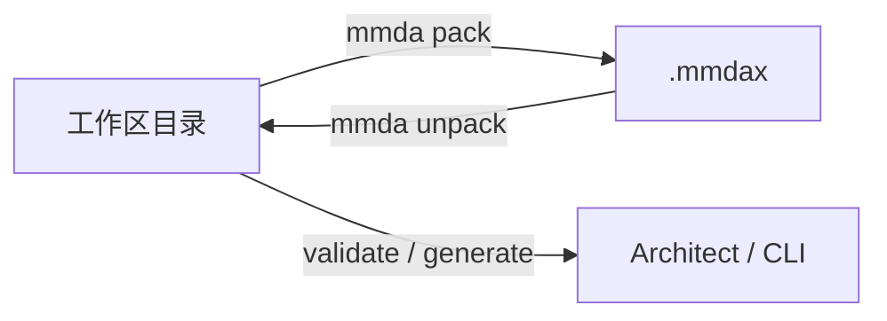

# MMDA 项目格式

> **formatVersion 2.0** · 与根目录 [mmda-workflow.md](../../mmda-workflow.md) §文件目录 对齐  
> Architect 项目的 **SSOT** 为分目录、分扩展名的 M语言 资产；图形与生成物为投影或附属。

## 0. 术语与双形态

| 术语 | 含义 |
|------|------|
| **MMDA 项目** | 工作区目录 + 根清单 `{projectCode}.mmda` + `biz/` `data/` `flow/` `ui/` 等 |
| **MMDA 源文件** | `.ma` `.mm` `.me` `.ms` `.mr` `.mf` `.mi` … — 按类型的 M语言 方言 |
| **项目清单** | 根目录 `{projectCode}.mmda` — **整个项目的描述文件**（非 M语言 模型） |
| **工作区（directory）** | 展开目录，Git / AI 友好，**日常 SSOT** |
| **归档包（archive）** | `{projectCode}.mmdax` — ZIP，内部路径与工作区 **1:1** |



**扩展名约定（勿混淆）**

| 扩展名 | 含义 |
|--------|------|
| `{code}.mmda` | **项目清单**（根目录唯一） |
| `.mm` / `.me` / … | **元模型 M语言 分片** |
| `{code}.mmdax` | **归档包**（ZIP，不是源文件） |

> **Legacy（formatVersion 1.x）**：`manifest.json` + `models/**/*.mmda` + `modules/modules.yaml`。工具应能识别并提示迁移；见 §12。

---

## 1. 工作区目录（formatVersion 2.0）

以多子系统 ERP 为例（`projectCode: erp`）：

```
erp/
├── erp.mmda                    # 项目清单（§2）
├── README.md                   # 项目说明
│
├── biz/                        # 业务架构 — 按子系统分解 Module 树
│   ├── base.ma                 # 基础数据
│   ├── crm.ma                  # 客户关系管理
│   ├── wms.ma                  # 仓储
│   ├── srm.ma                  # 供应商关系
│   ├── mes.ma                  # 制造执行
│   ├── hrm.ma                  # 人力资源
│   └── fi.ma                   # 财务
│
├── data/                       # 数据架构
│   ├── models/                 # 元对象（Record / View）
│   │   ├── Partner.mm
│   │   ├── Order.mm
│   │   └── Interview.mm
│   ├── enums/                  # 枚举（含 @State 状态枚举）
│   │   ├── OrderStatus.me
│   │   └── BomStatus.me
│   └── stms/                   # 状态机（STM，与 Record 解耦存放）
│       ├── OrderStatusChanged.ms
│       └── BomApproval.ms
│
├── flow/                       # 流程架构
│   ├── roles/                  # 角色
│   │   ├── SalesMan.mr
│   │   └── SalesManager.mr
│   ├── converters/             # 数据转换器（可选目录）
│   │   └── AsnItemToReceiptItem.mc
│   ├── crm.mf                    # 跨模块 BPMN 流程（被子系统 .ma 引用）
│   ├── crm.mf.g                  # crm.mf 的 DFD/BPMN 图形投影（布局）
│   ├── wms.mf
│   └── wms.mf.g
│
├── ui/                         # 交互设计 — 定制视图
│   ├── crm/
│   │   └── ProspectEditor.mi   # 无 .g；布局即 SSOT
│   └── hrm/
│       └── InterviewEditor.mi
│
├── doc/                        # 设计文档、评审纪要（Markdown）
│   └── architecture.md
│
├── codegen/profiles/           # 交付 — Codegen Profile（YAML，§9）
├── changelog/                  # 设计变更日志（JSON，§10）
├── generated/                  # 生成物（默认不打包）
└── .cursor/rules               # 工具链（可选，不默认打包）
```

### 1.1 与架构师工作流 / 导航树的对应

| 导航分区 | 目录 | 主要扩展名 |
|--------|------|------------|
| 业务架构 | `biz/` | `.ma` |
| 数据架构 · 枚举 | `data/enums/` | `.me` |
| 数据架构 · 对象 | `data/models/` | `.mm` |
| 数据架构 · STM | `data/stms/` | `.ms` |
| 流程架构 · 角色权限 | `flow/roles/` | `.mr` |
| 流程架构 · 数据流 | `flow/converters/` | `.mc` |
| 流程架构 · 工作流 | `flow/` | `.mf` |
| 交互设计 | `ui/` | `.mi` |

左侧面板标题为 **项目显示名**（如「人力资源」）；其下按上表分区展示，Feature 节点引用 `data/models/*.mm` 与 `ui/**/*.mi`。

### 1.2 扩展名总表

| 扩展名 | 全称（约定） | partType | 内容 |
|--------|--------------|----------|------|
| `.mmda` | **M**MDA **P**roject | `project` | 根清单 `{projectCode}.mmda`（JSON，§2） |
| `.ma` | **M**odule **A**rchitecture | `biz` | 子系统 Module 树、Feature 绑定 `model` / `ui` / `flow` |
| `.mm` | **M**eta **M**odel | `model` | `record` / `view` 定义 |
| `.me` | **M**eta **E**num | `enum` | `enum` 定义；`@State` 枚举可关联 `.ms` |
| `.ms` | **M**eta **S**tate machine | `stm` | `stm … on Record.field { action … }` |
| `.mr` | **M**eta **R**ole | `role` | `role` + `auth module` / `actions` |
| `.mc` | **M**eta **C**onverter | `converter` | `converter S->T { … }` |
| `.mf` | **M**eta **F**low | `flow` | 跨模块 `flow` / BPMN（.mf） |
| `.mi` | **M**eta **I**nterface | `ui` | 定制五视图：index / editor / details / search / report |
| `*.{ma\|mm\|ms\|mf}.g` | **G**raph 投影 | `graph` | JSON 布局/样式；SSOT 文件名 + `.g`，见 [graph-files.md](graph-files.md) |
| `.md` | — | `doc` | 文档 |
| `.mmdax` | — | `archive` | ZIP 归档包 |

所有 `.ma`–`.mi` 文件正文为 **M语言 方言**（语法见 [language/overview.md](../language/overview.md) 与 [mmda-workflow.md](../../mmda-workflow.md)）。

### 1.3 引用规则（跨目录）

`biz/*.ma` 通过**符号名**引用其他 part（解析器按项目索引解析路径）：

| `.ma` 字段 | 引用目标 | 示例 |
|------------|----------|------|
| `model` | `data/models/{Name}.mm` | `model: Interview` |
| `ui.editor` 等 | `ui/{subsystem}/{Name}.mi` | `ui: { editor: InterviewEditor }` |
| `flow` / `flows` | `flow/{subsystem}.mf` | `flow: crm` → `flow/crm.mf` |
| （Feature 行为） | `data/stms/{StmName}.ms` | 由 `model` 上 `@State` + STM 名关联 |

枚举引用：`Order.status : OrderStatus` → `data/enums/OrderStatus.me`。

### 1.4 Part 角色（pack 时）

| role | 路径 | 默认 pack |
|------|------|-----------|
| **core** | `erp.mmda`、`biz/`、`data/`、`flow/`、`ui/`、`**/*.{ma,mm,ms,mf}.g`、`codegen/`、`changelog/` | ✓ |
| **attachment** | `doc/`、`README.md` | ✓ |
| **generated** | `generated/` | ✗ |
| **tooling** | `.cursor/` | 可选 |

---

## 2. 项目清单 `{projectCode}.mmda`

根目录 **有且仅有一个** 项目文件，文件名 = `projectCode` + `.mmda`（如 `erp.mmda`）。

**格式**：JSON（UTF-8），便于 CLI / core 解析；与 Legacy `manifest.json` 字段对齐并扩展。

```json
{
  "formatVersion": "2.1",
  "projectCode": "erp",
  "projectLabel": "集团 ERP",
  "description": "CRM + MES + WMS + HRM …",
  "defaultModule": "mes",
  "includeDefault": true,
  "createdAt": "2026-06-27T00:00:00Z",
  "mmdaSpecVersion": "0.2",
  "defaultLocale": "zh-CN",
  "locales": ["zh-CN", "en", "zh-Hant"],
  "modules": [
    { "code": "base", "bizFile": "biz/base.ma", "systemCode": "B", "label": "基础数据" },
    { "code": "crm", "bizFile": "biz/crm.ma", "systemCode": "C", "label": "客户关系管理", "flowFile": "flow/crm.mf" },
    { "code": "mes", "bizFile": "biz/mes.ma", "systemCode": "M", "label": "制造执行" },
    { "code": "wms", "bizFile": "biz/wms.ma", "systemCode": "W", "label": "仓储", "flowFile": "flow/wms.mf" },
    { "code": "hrm", "bizFile": "biz/hrm.ma", "systemCode": "H", "label": "人力资源" }
  ],
  "items": [
    { "path": "data/models/mes/Legacy.mm", "include": false, "itemType": "model", "module": "mes" }
  ],
  "storage": { "kind": "directory" }
}
```

| 字段 | 说明 |
|------|------|
| `modules[]` | 与 `biz/*.ma` 一一对应（format 2.0 的 `subsystems` 已更名）；可选 `flowFile` 指向 `flow/*.mf` |
| `defaultModule` | 新建对象时的默认模块 / 导航默认展开（原 `defaultSubsystem`） |
| `includeDefault` | 未在 `items[]` 中列出的文件是否默认包含（默认 `true`） |
| `items[]` | **Visual Studio ItemGroup 风格**：仅记录与默认不同的包含状态；`include: false` = 从校验/生成中排除 |
| `parts` | 可选；pack 时写入完整注册表 + `checksum`（同 1.x §2.2） |

打开项目：`mmda open ./erp` 或 `mmda open erp.mmdax`（解压后读取包内 `erp.mmda`）。

---

## 3. 各类型文件说明

### 3.1 业务架构 · `biz/*.ma`

一文件 = 一**子系统**（Subsystem）的 Module 树。示例片段：

```ts
/// 制造执行系统
subsystem mes in Erp {
  /// 生产管理
  module M.03 Production {
    /// BOM 审批
    module M.03.032 BomApproval {
      model: Bom,
      ui: { editor: BomEditor, index: BomList },
      flow: mes-operate   // 可选，指向 flow/mes-operate.mf
    }
  }
}
```

功能架构图投影：`biz/mes.ma` ↔ **`biz/mes.ma.g`**（`graphKind: ma-module`），与 Module 树双视图同步。

### 3.2 数据架构

| 路径 | 文件 | 说明 |
|------|------|------|
| `data/models/` | `Partner.mm` | `record` / `view`；一类型一文件 |
| `data/models/` | `Partner.mm.g` | 可选；Record E-R 布局（`graphKind: mm-er`） |
| `data/enums/` | `OrderStatus.me` | `enum`；一枚举一文件 |
| `data/stms/` | `OrderStatusChanged.ms` | `stm Name on Record.field { … }`；**行为 SSOT** |
| `data/stms/` | `OrderStatusChanged.ms.g` | 可选；状态图布局（`graphKind: ms-stm`） |

Record **不在** `.mm` 内嵌完整 STM；`@State OrderStatusChanged` 指向 `data/stms/OrderStatusChanged.ms`。

图形语义（关系、状态、动作）在 M 语言 SSOT；**位置、颜色、路由** 在 `{SSOT}.g`，见 [graph-files.md](graph-files.md)。

### 3.3 流程架构

| 路径 | 文件 | 说明 |
|------|------|------|
| `flow/roles/` | `SalesMan.mr` | `role` + `auth module` / `actions` / `scope` |
| `flow/converters/` | `AsnToReceipt.mc` | `converter S->T { field->field, … }` |
| `flow/` | `crm.mf` | 跨模块 `flow`；BPMN 活动 / 网关 / 消息流 |
| `flow/` | `crm.mf.g` | 可选；DFD / BPMN 图形布局（`views[]`，见 [graph-files.md](graph-files.md)） |

**顺序**（与 UI 一致）：先 `roles/`，再 `converters/` + `stms/`，最后 `*.mf` 工作流。

### 3.4 交互设计 · `ui/**/*.mi`

一文件 = 一套定制视图（通常对应一个 Feature 的 `ui` 块）：

```
ui/hrm/InterviewEditor.mi
```

```ts
/// 面试编辑器
ui InterviewEditor for Interview {
  index: InterviewList,
  editor: InterviewEditorPane,
  details: InterviewDetails,
  search: InterviewSearch,
  report: InterviewReport
}
```

未提供 `.mi` 时，框架按 `data/models/*.mm` 元数据生成标准 CRUD。

---

## 4. 归档包 `.mmdax`

```
erp.mmdax                 # application/vnd.mmda.package+zip
├── erp.mmda               # 必须在根；storage.kind = "archive"
├── biz/...
├── data/...
├── flow/...
├── ui/...
├── doc/...
└── ...                   # 不含 generated/（默认）
```

```bash
mmda pack ./erp -o dist/erp.mmdax
mmda unpack dist/erp.mmdax -o ./erp-restored
mmda open dist/erp.mmdax
```

| 选项 | 说明 |
|------|------|
| `--exclude` | 默认 `generated/**`、`.git/**` |
| `--with-generated` | 包含 `generated/` |
| `--with-tooling` | 包含 `.cursor/` |
| `--update-parts` | 刷新 `parts[]` 与 checksum |

---

## 5. partType 与 contentType（parts 注册表）

| partType | 路径模式 | contentType（建议） |
|----------|----------|---------------------|
| `project` | `{projectCode}.mmda` | `application/vnd.mmda.project+json` |
| `biz` | `biz/*.ma` | `text/x-mmda+ma` |
| `model` | `data/models/*.mm` | `text/x-mmda+mm` |
| `enum` | `data/enums/*.me` | `text/x-mmda+me` |
| `stm` | `data/stms/*.ms` | `text/x-mmda+ms` |
| `role` | `flow/roles/*.mr` | `text/x-mmda+mr` |
| `converter` | `flow/converters/*.mc` | `text/x-mmda+mc` |
| `flow` | `flow/*.mf` | `text/x-mmda+mf` |
| `ui` | `ui/**/*.mi` | `text/x-mmda+mi` |
| `graph` | `**/*.{ma,mm,ms,mf}.g` | `application/vnd.mmda.graph+json` |
| `codegen-profile` | `codegen/profiles/*.yaml` | `application/yaml` |
| `changelog` | `changelog/*.json` | `application/json` |
| `doc` | `doc/**`、`README.md` | `text/markdown` |

`parts[].syncRef` 示例：`mes.Bom`、`OrderStatusChanged`、`CrmFlow`、`InterviewEditor`。

---

## 6. 单文件粒度与命名

| 规则 | 说明 |
|------|------|
| 一对象一文件 | `Order.mm`、`OrderStatus.me`、`OrderStatusChanged.ms` 各一文件 |
| 文件名 = 主符号名 | 与 M语言 内 `record Order` / `enum OrderStatus` 一致 |
| 子系统前缀（可选） | 大项目可在 `data/models/mes/Bom.mm` 分子目录；`syncRef` 仍为 `mes.Bom` |
| 大小写 | PascalCase 类型名；子系统 `biz` 文件用小写 `mes.ma` |

小示例项目（单 mes 域）可仅含 `biz/mes.ma`，不拆 `crm.ma` 等。

---

## 7. mmda-mes 示例（formatVersion 2.0）

标准示例 `examples/mmda-mes/` 布局：

| 路径 | 说明 |
|------|------|
| `mmda-mes.mmda` | 项目清单 |
| `biz/base.ma` / `biz/mes.ma` | Module 树 |
| `data/models/**/*.mm` | Record / View |
| `data/enums/**/*.me` | 枚举 |
| `data/stms/**/*.ms` | 状态机（如 `BomApproval.ms`） |
| `ui/mes/*.mi` | 定制视图（可选） |

Legacy formatVersion 1.x（`manifest.json` + `models/**/*.mmda`）迁移时，按上表拆分至对应目录。

---

## 8. Codegen Profile

仍为 YAML，路径不变：

`codegen/profiles/prototype-sqlite.yaml` — 见旧版 §9 示例。

---

## 9. changelog

`changelog/000001.json` — 结构不变；`refKey` 使用新 syncRef（如 `mes.Bom.status`）。

---

## 10. Git 建议

- **提交**：`*.mmda`（根清单）、`biz/`、`data/`、`flow/`、`ui/`、`**/*.{ma,mm,ms,mf}.g`、`codegen/profiles/`、`doc/`
- **忽略**：`generated/`
- **一般不提交** `.mmdax`（CI 执行 `mmda pack` 产出）

---

## 11. 实现状态

| 能力 | formatVersion 2.0 规范 | mmda-core / Architect |
|------|------------------------|------------------------|
| 目录 + 扩展名 | ✓ 本文 | 迁移中（仍读 1.x） |
| `{code}.mmda` 清单 | ✓ | 待实现 |
| `.mm` / `.me` / `.ms` … 解析 | ✓ 语法见 workflow | Phase 2 分扩展名解析器 |
| pack / unpack | ✓ | ✓（1.x 路径） |
| 导航搜索按 kind | — | ✓（`record` / `stm` / `ui`） |

---

## 12. Legacy formatVersion 1.x（兼容）

```
manifest.json
schemas/*.schema.json
models/**/*.mmda          # M语言 混合 record/enum
modules/modules.yaml
actions/**/*.yaml
events/**/*.mmda
```

识别：`manifest.json` 存在且 **无** 根 `{projectCode}.mmda`，或 `formatVersion` `"1.0"` / `"1.1"`。

迁移工具（规划）：`mmda migrate --to 2.0 ./legacy-project`

---

## 13. 相关文档

- [workflow.md](workflow.md) — 六步工作流与导航树
- [mmda-workflow.md](../../mmda-workflow.md) — 设计笔记 SSOT（M语言 示例）
- [graph-files.md](graph-files.md) — `*.g` 图形投影格式
- [diagrams.md](diagrams.md) — 图形语义与 SSOT 映射
- [meta-model.md](../../../lang/meta-model.md — 逻辑元素定义
