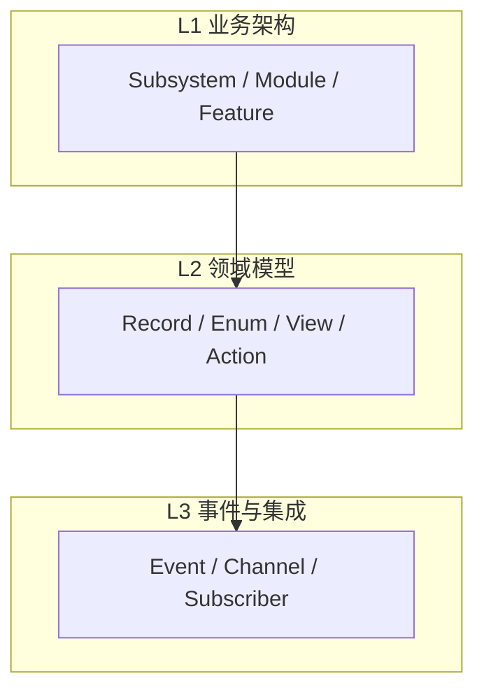

# MMDA 总览

## 是什么

么么哒（**M**eta **M**odel **D**riven **A**rchitecture）是面向企业应用（MES、WMS、CRM、IoT 等）的**元数据驱动架构规范**。

核心命题：

> **一切围绕数据**——存储、呈现、计算、事件架构描述在同一套元模型中；  
> 架构师维护 `.mmda` 项目（SSOT），工具生成可运行原型，AI 在 KEEP 区补全实现。

吸收 [MDA](https://www.omg.org/mda)、[DDD](https://www.martinfowler.com/tags/domain%20driven%20design.html)、敏捷交付等思想，但**不绑定**任何编程语言或数据库。

## 设计原则

1. **语言无关** — Codegen Profile 可插拔  
2. **平台无关** — `DataType` 映射各栈  
3. **SSOT** — MMDA 项目（工作区目录；`.mmdax` 用于交换）+ M语言；图形是投影  
4. **设计可运行** — 输出可启动的原型，不仅是文档  
5. **AI 可调用** — MCP/CLI 读写项目、校验、生成  
6. **变更可追溯** — Design Change Log ≠ Domain Event  

## 背景与动机

Brooks《没有银弹》区分软件的**本质困难**（概念设计与验证）与**偶然困难**（用代码表示设计）。MMDA 减少偶然困难：元数据一次定义，多层自动生成，人力集中在业务逻辑与架构决策。

| 痛点 | 做法 |
|------|------|
| 成本高、周期长 | 元模型 + Codegen |
| 原型慢 | Profile 生成 CRUD/API/UI 骨架 |
| 质量不一致 | `mmda validate` + Spec 层约束 |

MMDA **不是**零代码魔法：Handler / Service / UiLogic 仍需实现。详见 [glossary.md](glossary.md) 中 GENERATED / KEEP 区。

## 三层架构



| 层 | 元素 |
|----|------|
| L1 | Module 树、Use Case（可选） |
| L2 | Record、Field、Relation、STM |
| L3 | Event、DFD、订阅 |

## 生态位置

```
架构师 → MMDA-Architect → MMDA 项目（SSOT）→ Codegen Profile → 原型
                              ↓
                         AI Tools → KEEP 区实现
```

工作区为展开目录；交付与备份可用 `.mmdax` 归档包（见 [architect/project-format.md](architect/project-format.md)）。

## M语言

元模型的文本语法，与 AST 双向同步。见 [language/overview.md](language/overview.md)。

## 典型工作流

1. 创建 `.mmda` 项目，划分 Module（L1）  
2. 编写 M语言 / E-R 图，定义 Record 与 Action（L2）  
3. `mmda validate`  
4. `mmda generate --profile …`  
5. 在 `handlers/` 等 KEEP 区实现逻辑；AI 通过 [ai/tools.md](ai/tools.md) 协作  

分步说明：[guide/quickstart.md](guide/quickstart.md)。示例：[examples/mmda-mes/README.md](../examples/mmda-mes/README.md)。

## 延伸阅读

- [重读《没有银弹》——兼论低代码技术](http://www.cniteyes.com/archives/37322)
- [构建之法 — 参考书汇总](https://www.cnblogs.com/xinz/p/4470424.html)

## 阅读导航

| 文档 | 用途 |
|------|------|
| [architect/specification.md](architect/specification.md) | Architect 工具规格 |
| [architect/meta-model.md](../../lang/meta-model.md) | 元模型定义 |
| [architect/project-format.md](architect/project-format.md) | 项目目录结构 |
| [language/](language/overview.md) | M语言 |
| [legacy/](legacy/README.md) | 旧版 Java/DDL 补充（非 SSOT） |
