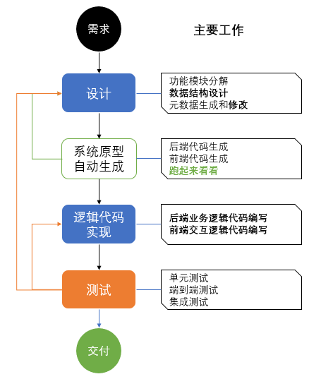

# 快速上手

> 本文是**上手入口**：先看五阶段全貌（§0），再以仓库示例 **`examples/mmda-mes`** 走一遍（§1–§6），最后是**配置面速查（§7）**、**载荷形态（§8）**、**定制点全景（§9）**与**常见坑（§12）**——后四节来自 2023 版《MMDA 快速上手》用户手册，是可上手的既有约定。
> 元模型定义见 [meta-model.md](../meta-model.md)，勿与 Legacy 导入混淆；旧手册与本篇的差异见 [legacy/README.md](../legacy/README.md)。

---

## 0. 四阶段全貌（谁做什么）



> **阶段口径（✔ 2026-09-25 作者裁定）**：**S1 意图 → S2 建模 → S3 验收 → S4 交付**（[`workflows-phase.md`](../workflows-phase.md) §3）。下图为作者原图，**阶段名以本表为准**；图中**设计 ↔ 原型 ↔ 实现**之间的回环就是 **S2 建模的内部环**（改模型即回到设计，重新生成后跑起来看）。

| 阶段 | 谁做 | 做什么 | 产物 | 真源 |
| --- | --- | --- | --- | --- |
| **S1 意图** | 业务 + 架构师（AI 辅助；**人类参与最多**） | 解决 **why / what**：三层需求 → SERU 四要素；**在需求阶段识别关键用户（Role）**；**定 UAT（验收准则，可执行）** | SRS / 用例、**Role 清单**、**可执行 UAT** | [requirements.md](../requirements.md)、[workflows.md](../workflows.md) |
| **S2 建模** | **架构师 + 设计师**（图形化工具；AI 起草）+ **程序员**（KEEP 区） | 解决 **how**：① 功能模块分解 + Action ② 数据结构设计（类 / E-R / 枚举 / STM）③ 元数据生成与修改（五视图、字段呈现、Flow / DataFlow / BPMN）④ **原型自动生成**（`mmda generate`：三端产物 + DDL + 接口骨架 + TS 类型，「跑起来看看」）⑤ 逻辑代码实现（GENERATED 区外的 KEEP 区 / `handlers/`） | `.mmda` 项目 + 声明（`intents/**`、`models/**`）+ `generated/` + `handlers/` | [meta-model.md](../meta-model.md)、[presentation.md](../presentation.md)、[runtime.md](../runtime.md) §9、[targets.md](../targets.md)（P5–P6） |
| **S3 验收** | **人定标准 + 审核；AI 跑与诊断** | 测试与验证：用例从声明**机械生成**、AI 造数（人审）、三端一致性、覆盖率与变异、**UAT 全绿 + 验收单签字** | 用例 + 基线 + 覆盖率 + 验收单 + 质量报告 | [testing.md](../testing.md)、[quality.md](../quality.md) §5、[targets.md](../targets.md) §5 |
| **S4 交付** | 框架 + 交付负责人 | 交付物与部署：离线交付包 + `mmda doctor` 自检 + 版本与交付清单（**每轮迭代可追溯、可回滚**） | 生成物 / 镜像 / `SHA256SUMS` / 版本清单 | [workflows-phase.md](../workflows-phase.md) §3.5、[vision.md](../vision.md) §5.2.1 |

> **运维在四阶段之外**（✔ 2026-09-25 作者）：**IDE 不提供运维能力**，运维由 MMDA 底座**集成监控平台**；**运维日志与报告**作为**下一轮迭代的输入**（[workflows-phase.md](../workflows-phase.md) §3.2 / §3.5）。

> **一句话记法**：**设计在元数据里、逻辑在 KEEP 区、验收在一致性套件 + UAT**——这就是「**设计师配置 + 程序员定制**」的固定模式（[runtime.md](../runtime.md) §4）。

---

## 1. 流程


| 步骤 | 操作 | 产出 |
|------|------|------|
| 1 | 需求：三层需求 + **识别 Role**（关键用户） | SRS / 用例、Role 清单 |
| 2 | 设计：Module 三级 + Record/Relation + STM/Flow | `biz/*.ma`、`data/models/*.mm`、`data/stms/*.ms`、`flow/roles/*.mr` |
| 3 | 复制或新建项目目录 | `{projectCode}.mmda`、`biz/`、`data/` |
| 4 | 编辑 `data/models/`、`data/stms/`、`biz/*.ma` | Record、STM、Module 树 |
| 5 | 校验 | 零 error |
| 6 | 选择 Codegen Profile 生成 | `generated/` |
| 7 | 实现 Action / API 逻辑 | `handlers/` |
| 8 | 运行原型 → 测试 → 交付 | 可访问应用、用例套件、交付包 |

## 2. 示例项目结构

```
examples/mmda-mes/
├── mmda-mes.mmda              # 项目清单（formatVersion 2.0）
├── biz/
│   ├── base.ma                # 基础数据 Module 树
│   └── mes.ma                 # MES Module 树
├── data/
│   ├── models/base/           # Partner、Material …
│   ├── models/mes/            # Bom、ProductionOrder …
│   ├── enums/
│   └── stms/
├── ui/mes/                    # 定制视图（可选）
├── codegen/profiles/
└── conventions.md
```

- **BOM**：完整 STM（`BomApproval`：submit → certify → approve …）
- **生产订单**：`ProductionOrderLifecycle` 等 Action
- 项目由 MySQL `mmda_metadata` 逆向生成，可用 `python tools/reverse_mmda_project.py` 重新导出

## 3. Module 三级（L1）

| moduleType | 层级 | 示例 |
|------------|------|------|
| 0 | Subsystem | `M` 制造 |
| 1 | Module | `M.01` 工厂模型 |
| 2 | Feature | `M.01.032` BOM → 绑定 `model: Bom` |

Feature 必须绑定 Record；Action 写在 `data/stms/*.ms`，与 Module 的 `stm:` 引用一致。

**编号即导航路径**：`M.01.032` = 子系统字母 + 两级序号；旧版手册的写法（`H` 人力资源 → `H.02` 组织人事 → `H.02.003` 职员）是同一套约定，**模块编码同时决定菜单顺序**。**Action 是 Feature 上的操作**，例如职员模块的 `promote`（升职）/ `leave`（离职）/ `dismiss`（辞退），属性见 [meta-model.md](../meta-model.md) §9。

## 4. 数据库设计也是入口之一（DDL 注释 → `.m`）

新项目**直接从 M 语言写**（§5）；若已有数据库，或团队习惯「从存储层设计起步」，可以从 DDL 走——**表/列注释就是元数据的输入**（旧版手册的主路径，现为 [`mmda import --from-ddl`](../legacy/import-from-ddl.md)）：

```sql
CREATE TABLE `department` (
 `deptID`  BIGINT(20) NOT NULL COMMENT '部门标识：PK',
 `deptCode` VARCHAR(15) NULL DEFAULT NULL COMMENT '部门编码：UK',
 `deptType` TINYINT(3) NOT NULL DEFAULT '0' COMMENT '部门类型：0;DEPARTMENT;内设部门|1;DIVISION;子公司',
 `leaderID` BIGINT(20) NULL DEFAULT NULL COMMENT '部门经理：REF Employee(empID,empName)',
 `deptCodeName` VARCHAR(50) AS (concat(`deptCode`,' ',`deptName`)) STORED COMMENT '部门全称',
 INDEX `IDX_department_deptCode` (`deptCode`) USING BTREE
) COMMENT='@Department 部门。部门及分支机构，包括加盟公司'
```

| 位置 | 规则 | 变成什么 |
| --- | --- | --- |
| 表注释 `@Department 部门` | `@名` = **Record 英文名（PascalCase）**，中文 = `displayLabel` | `record Department`（MySQL 表名不区分大小写，故需 `@` 声明真名） |
| 列注释 `：PK` | **分区键**（多租户，**不是** PRIMARY KEY 的同义词） | `partitionKey` |
| 列注释 `：UK` | **租户内**唯一键 | `uniqueKey` |
| 列注释 `值;名称;标签\|…` | 枚举定义 | `Enum` + `fieldRef` |
| 列注释 `REF 表(引用列,显示列…)` | 外键 + 显示值对象（小表、走缓存） | `@Ref` |
| 列注释 `HAS_ONE 表(…) AS 属性 [WHERE(…)]` | 一对一导航（整实体） | `@One` |
| `AS (…expr…) STORED` | 计算列 | `computed` + `formula` |
| 索引名 `IDX_<表>_<列>` | 索引命名建议（不硬约束） | 见 [naming.md](../naming.md) §3.3 |

> 完整对照表（含多租户 ID 位分配、与 M 语言互转表、逆向流程图）见 [legacy/import-from-ddl.md](../legacy/import-from-ddl.md)。`.m` 里的写法见 [records.md](../records.md) 与 [datatypes.md](../datatypes.md)。

## 5. 编写 M语言（片段）

```sql
record Bom {
    bomId uint64 identity generated,
    bomNo varchar(30) unique,

    @State BomApproval
    status BomStatus default NEW,

    @Many
    items BomItem[+] readonly,
}
```

语法详见 [records.md](../records.md)、[statements.md](../statements.md)。

## 6. 命令

```bash
cargo run -p mmda-cli -- open examples/mmda-mes
cargo run -p mmda-cli -- validate examples/mmda-mes
cargo run -p mmda-cli -- list-records examples/mmda-mes
cargo run -p mmda-cli -- pack examples/mmda-mes -o dist/mmda-mes.mmdax --update-parts
cargo run -p mmda-cli -- unpack dist/mmda-mes.mmdax -o ./mmda-mes-restored
```

`mmda generate` 为规划命令，见 [ide/specification.md](../ide/specification.md)。

**旧版命令对照**（2023 用户手册，历史资产；等价关系见 [legacy/java-factory.md](../legacy/java-factory.md)）：

| 旧版 | 现在 |
| --- | --- |
| `mmda meta <app>`（DDL → `mmda_metadata` 库） | `mmda import --from-ddl` → 直接写 `.mmda` 项目 |
| `mmda java <app> [--models｜--data｜--services｜--controllers]` | `mmda generate --profile <profile>`（capability 分档） |
| `mmda vui <app>`（Vue 3 + TS） / `mmda flui <app>`（Flutter） | 同上（前端只出 TS 类型与 `MetaUi` 契约，渲染方 = mmda-vue） |

---

## 7. 元数据配置面速查（设计期最常改的都在这里）

**Field（元列）**——存储语义（[meta-model.md](../meta-model.md) §4）与呈现语义（[presentation.md](../presentation.md) §2）**分离**：

| 属性 | 管什么 | 典型值 |
| --- | --- | --- |
| `groupLabel` | 表单分组 + 排序 | 主信息 `a1`…`a9`、`b1`…；概要信息 `s1`…`s9`（数字解析为分组序号） |
| `listed` | 是否在列表视图默认列出 | `true` / `false` |
| `filterable` | 是否允许过滤（**有索引的字段默认允许**） | `true` / `false` |
| `readOnly` | UI 层只读（编辑视图不许改） | `true` / `false`（`@Computed` 恒只读） |
| `hidden` | UI 默认隐藏 | `true` / `false` |
| `fixedFilter` | **子类型/视图固定过滤**：在列表视图上呈现为**顶端页签**，习惯用状态字段（如「组建中 / 运作中 / 已关闭」） | Record 级属性 |
| `formatter` / `align` / `renderer` / `editor` / `placeholder` | 只读格式化（`D` 日期、`N3` 三位小数）、对齐（`0` 左 / `1` 右 / `2` 居中）、只读呈现器、编辑控件（`dropdown` / `searchBox` / `numberInput`）、占位符 | UiField 侧；`fieldName` **可跨 Record 复用、自动生成勿手改** |

**关系**（[meta-model.md](../meta-model.md) §4.3 / §5）：`@Ref`（外键 + 显示值对象，**无导航**，小表走缓存，UI 默认 dropdown）↔ `@One`（**有导航属性**，UI 默认 searchBox）↔ `@Many`（子表/子网格）；**同一个外键列因关系类型不同会生成不同的 UiField，呈现可以不一样**。
一对多关系是**手写的一等声明**（旧版是库里的一个字符串，见 [meta-model.md](../meta-model.md) §5），属性含连接条件 `joinOn`（`remoteKey=@localKey`）、**UI 布局顺序**（`relationIdx`，对应旧版手册的 `relationIdx`）、显示标题（`displayLabel`）、`defaultFilter` / `defaultSort`、加载策略（`eager`/`lazy`）。

**多租户**：`partitionKey` 指向带 `@Partitioned` 的主键列（**完整 ID = 高 28 位 tenantId（27 位有效）+ 低 36 位 realId**；✔ 2026-09-25 改正，原写「高 16 位 / 低 48 位」是旧布局残留）；**物理表分区**（`partitioned`）时按当前租户生成分区内查询以优化性能，未分区时用 `id BETWEEN minID AND maxID` 隔离；**应为租户内唯一键（`uniqueKey`）建索引**。

---

## 8. 你会看到的 JSON（载荷形态）

关系与枚举在 API 上的既有约定（决定「前端拿到什么」，见 [legacy/runtime-java.md](../legacy/runtime-java.md) §API 序列化、[api.md](../api.md) §3.5）：

```json
{
  "empID": "812349029222309",
  "empNo": "E001",
  "empName": "Roy Luo",
  "gender": "MALE",
  "workDeptID": "812349029233108",
  "workDepartment": { "deptID": "812349029233108", "deptName": "采购部" },
  "techTitleID": 1205,
  "customProperties": { "$gender": "男", "$techTitleID": "经济师" }
}
```

| 形态 | 说明 |
| --- | --- |
| **大整数 → 字符串** | `BIGINT` 超 JS 安全整数范围时以 `string` 传输（`"empID": "812349029222309"`），**精度优先**（[api.md](../api.md) §3.5） |
| **枚举按名** | `gender` 序列化为 `"MALE"`（枚举成员名 `UPPER_SNAKE`，见 [naming.md](../naming.md) §1） |
| **`@One` → 嵌套对象** | 一对一导航变成对象属性（`workDepartment`） |
| **`@Ref` / 枚举的显示标签** | 放 `customProperties.$<字段名>`（**不污染主字段类型**，且随 locale 变） |

---

## 9. 定制点全景（设计师配置 + 程序员定制）

**同一个模型，设计师在工具里配、程序员在代码里定制**——定制点已经存在且有固定名字：

| 层 | 定制点 | 说明 |
| --- | --- | --- |
| **后端** | 生命周期钩子（**封闭枚举**） | `beforeSave` / `beforeInsert` / `beforeValidate` / `validate` / `beforeDelete` … 与 `afterSaved` / `afterInserted` / `afterDeleted` …；`before*` 在事务内、`after*` 在提交后（**`after*` 必须幂等**）——见 [runtime.md](../runtime.md) §3–§4、[architecture-review.md](../architecture-review.md) ARCH-109 |
| **前端（mmda-vue）** | `UiLogic` 视图钩子 | `beforeIndex`（列表）/ `beforeEdit`（编辑）/ `beforeDetails`（详情）/ `beforeSearch`（查询）；每个视图返回该视图的字段与交互逻辑。**⚑ 前端工程的目录与文件划分（`src/modules/*_logic.ts` / `*_view.ts` / `*_listview.ts` 等）不是规范内容**（✔ 2026-09-24 裁），属 mmda-vue 项目内部约定——规范只保证 `MetaUi` |
| **前端** | 字段级 API | `lockIf`（条件锁定）、`hideIf` / `hideIfEmpty`（条件隐藏）、`onChange`（联动清值）、`onValidate`（关联校验，默认已有 required / maxLength / 类型校验）、`requiredIf`（条件必填，`onValidate` 的快捷方式） |
| **前端** | 视图级替换 | `setCustomEditor(...)` / `setCustomRenderer(...)`（替换生成的标准编辑/呈现控件；皮肤内部的自由，见 [presentation.md](../presentation.md) §5.1） |

参考实现摘要见 [legacy/runtime-java.md](../legacy/runtime-java.md) §UiLogic 钩子；语言侧的声明形态待裁（[errata.md](../errata.md) §三-20）。

## 10. 生成与手写边界

Codegen 产出含 **GENERATED** 标记区，再生成时覆盖；业务逻辑写在 **KEEP** 区或 `handlers/`。约定见项目内 `conventions.md` 与 [ai/vibe-spec.md](../ai/vibe-spec.md)。

旧版 Java 实现的标记形式（同一协议）：`//region ~GENERATED PARTS BEGIN` … `//endregion of ~GENERATED PARTS END`，其下为手写区——**再次生成只覆盖 GENERATED 区**。

## 11. 从已有数据库导入？

`mmda-mes` 即由 `mmda_metadata` 逆向的参考实现。若从 Legacy DDL 或 MySQL 元库迁移，见 [legacy/README.md](../legacy/README.md)（补充说明，非主路径）。

## 12. 常见坑（都踩过）

| 坑 | 现象 | 处理 |
| --- | --- | --- |
| **MySQL 表名不区分大小写** | 库里的表是 `department`，但你期望的 Record 名是 `Department` | 用表注释 `@Department` 声明真名；DDL 一律**加方言引号**，见 [naming.md](../naming.md) §3.3 |
| **`PK` 不是主键** | 以为列注释里的 `PK` 是 PRIMARY KEY | `PK` = **分区键（partitionKey）**，多租户 BIGINT，常与主键同列 |
| **`REF` 当 `HAS_ONE` 用** | 大表用 `REF` → 显示值缓存不划算；小表用 `HAS_ONE` → 每条查询多拉整个实体 | `REF` 只给**小表、不常改**；要导航属性才用 `@One` |
| **多租户不隔离** | 忘了分区键或唯一键没索引 → 越租户查询、慢查询 | 建表时定 `partitionKey`、给 `uniqueKey` 建索引；`partitioned` 与 `BETWEEN` 两形态择一 |
| **配置里写明文口令** | `dataSource.password` 直接进版本库 | **凭据不进真源**（本仓旧配置的样例口令已脱敏，见 §6 对照表）；环境差异只进 RuntimeProfile |
| **把 `mmda_metadata` 当 SSOT** | 元数据存在库里，与代码/模型不同步 | 新规范唯一真源 = `.mmda`（git 管），元数据库降为**产物/缓存**，见 [`..\..\PLAN.md`](../../PLAN.md) §0 |

## 下一步

- [ide/specification.md](../ide/specification.md) — 架构师六步工作流与建模域
- [ide/diagrams.md](../ide/diagrams.md) — E-R / STM 与元模型
- [ai/tools.md](../ai/tools.md) — AI 协作
- [glossary.md](../glossary.md) — 术语（先看 §3.1/§3.2，避免用错名字）
