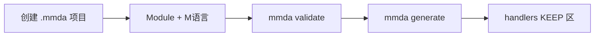

# 快速上手

以仓库示例 **`examples/mmda-mes`** 为主线，走完从建模到校验的流程。元模型定义见 [architect/meta-model.md](../meta-model.md)，勿与 Legacy 导入混淆。

## 1. 流程



| 步骤 | 操作 | 产出 |
|------|------|------|
| 1 | 复制或新建项目目录 | `{projectCode}.mmda`、`biz/`、`data/` |
| 2 | 编辑 `data/models/`、`data/stms/`、`biz/*.ma` | Record、STM、Module 树 |
| 3 | 校验 | 零 error |
| 4 | 选择 Codegen Profile 生成 | `generated/` |
| 5 | 实现 Action / API 逻辑 | `handlers/` |
| 6 | 运行原型 | 可访问应用 |

## 2. 示例项目结构

```
examples/mmda-mes/
├── mmda-mes.mmda              # 项目清单（formatVersion 2.0）
├── biz/
│   ├── base.ma                # 基础数据 Module 树
│   └── mes.ma                 # MES Module 树
├── data/
│   ├── models/base/           # Partner、Material …
│   ├── models/mes/            # Bom、ProductionOrder …
│   ├── enums/
│   └── stms/
├── ui/mes/                    # 定制视图（可选）
├── codegen/profiles/
└── conventions.md
```

- **BOM**：完整 STM（`BomApproval`：submit → certify → approve …）
- **生产订单**：`ProductionOrderLifecycle` 等 Action
- 项目由 MySQL `mmda_metadata` 逆向生成，可用 `python tools/reverse_mmda_project.py` 重新导出

## 3. Module 三级（L1）

| moduleType | 层级 | 示例 |
|------------|------|------|
| 0 | Subsystem | `M` 制造 |
| 1 | Module | `M.01` 工厂模型 |
| 2 | Feature | `M.01.032` BOM → 绑定 `model: Bom` |

Feature 必须绑定 Record；Action 写在 `data/stms/*.ms`，与 Module 的 `stm:` 引用一致。

## 4. 命令（当前 CLI）

```bash
cargo run -p mmda-cli -- open examples/mmda-mes
cargo run -p mmda-cli -- validate examples/mmda-mes
cargo run -p mmda-cli -- list-records examples/mmda-mes
cargo run -p mmda-cli -- pack examples/mmda-mes -o dist/mmda-mes.mmdax --update-parts
cargo run -p mmda-cli -- unpack dist/mmda-mes.mmdax -o ./mmda-mes-restored
```

`mmda generate` 为规划命令，见 [architect/specification.md](../ide/specification.md)。

## 5. 编写 M语言（片段）

```sql
record Bom {
    bomId uint64 identity generated,
    bomNo varchar(30) unique,

    @State BomApproval
    status BomStatus default NEW,

    @Many
    items BomItem[+] readonly,
}
```

语法详见 [language/records.md](../records.md)、[language/behaviors.md](../statements.md)。

## 6. 生成与手写边界

Codegen 产出含 **GENERATED** 标记区，再生成时覆盖；业务逻辑写在 **KEEP** 区或 `handlers/`。约定见项目内 `conventions.md` 与 [ai/vibe-spec.md](../ai/vibe-spec.md)。

## 7. 从已有数据库导入？

`mmda-mes` 即由 `mmda_metadata` 逆向的参考实现。若从 Legacy DDL 或 MySQL 元库迁移，见 [legacy/README.md](../legacy/README.md)（补充说明，非主路径）。

## 下一步

- [architect/diagrams.md](../ide/diagrams.md) — E-R / STM 与元模型
- [ai/tools.md](../ai/tools.md) — AI 协作
