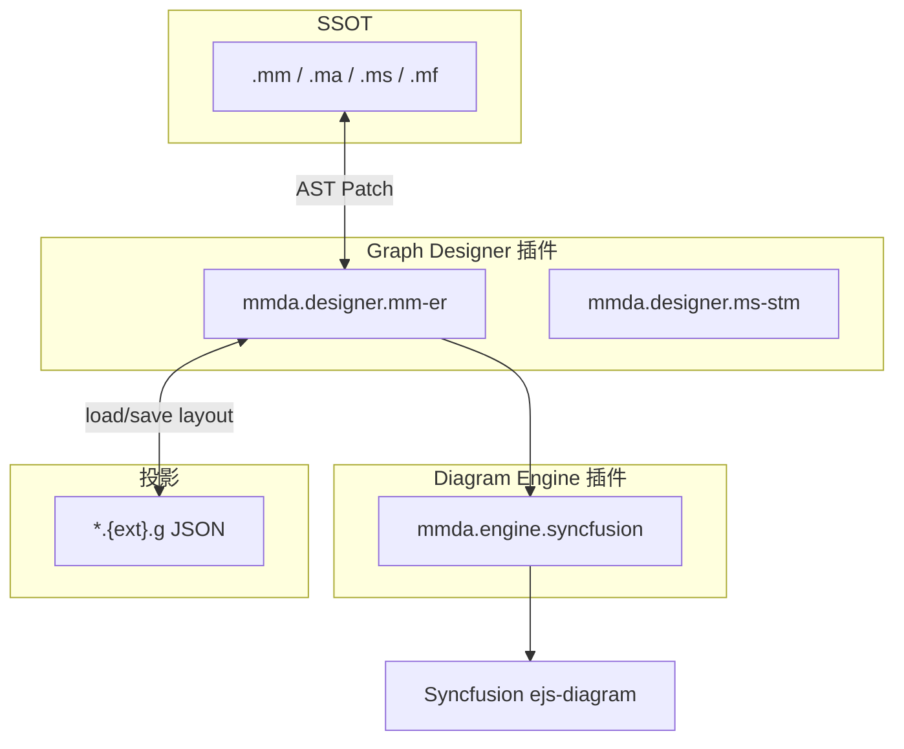

# 图形投影文件（`*.g`）

> **formatVersion 1.0** · 与 [project-format.md](../lang/project.md)、[diagrams.md](diagrams.md)、[diagram-adapters.md](diagram-adapters.md) 配合使用

## 1. 设计原则

| 原则 | 说明 |
|------|------|
| **SSOT 在 M 语言** | 语义（实体、字段、关系、状态、动作、流程）只写在 `.ma` / `.mm` / `.ms` / `.mf` / `.mb` / `.mi` |
| **视图在 `.g`** | 图元位置、尺寸、颜色、路由、折叠、画布缩放等**不写入**源文件 |
| **后缀伴生** | 在 SSOT 完整文件名后追加 `.g`：`Equipment.mm` → `Equipment.mm.g` |
| **syncRef 绑定** | `.g` 内每个图元通过 `syncRef` 指向 SSOT 元素；SSOT 删除后图元标记为 orphan |
| **引擎可换** | `.g` 存厂商中性布局 + 可选 `enginePayload`；默认引擎为 Syncfusion |

```
Equipment.mm  ──语义编辑──►  MetaRecord (AST)
      ▲                           │
      │                           │ 增删改关系 → Patch .mm
      │                           ▼
Equipment.mm.g ◄──布局编辑──  GraphDesigner（插件）
      │                           │
      └──── 仅 position/style ────┘
```

**`.mi` 例外**：界面五视图（index / editor / details / search / report）的控件树与布局即 SSOT 本身，**不需要** `.g`。

## 2. 命名规则

**统一规则**：`{path/to/Name}.{ma|mm|ms|mf|mb}.g`

| SSOT | 投影 | graphKind |
|------|------|-----------|
| `biz/mes.ma` | `biz/mes.ma.g` | `ma-module` |
| `data/models/mes/Equipment.mm` | `data/models/mes/Equipment.mm.g` | `mm-er` |
| `data/stms/OrderStatusChanged.ms` | `data/stms/OrderStatusChanged.ms.g` | `ms-stm` |
| `flow/crm.mf` | `flow/crm.mf.g` | `mf-flow` / `mf-dfd` / `mf-map`（数据流，多视图，见 §4.5） |
| `flow/crm.mb` | `flow/crm.mb.g` | `mb-bpmn`（跨模块流程） |
| `ui/hrm/InterviewEditor.mi` | — | 无 `.g` |

约定：

1. **同目录**：投影与 SSOT 同目录，不放到单独的 `diagrams/` 树（Legacy `diagrams/**/*.json` 迁移为 `*.{ext}.g`）。
2. **可选**：无 `.g` 时设计器用默认自动布局；首次拖拽或改样式时创建。
3. **pack**：`.g` 与对应 SSOT 同属 **core**，一并提交 Git。
4. **Glob**：`**/*.mm.g`、`**/*.ma.g`、`**/*.ms.g`、`**/*.mf.g`、`**/*.mb.g`。

## 3. partType 与 MIME

| 扩展名模式 | partType | MIME |
|------------|----------|------|
| `*.{ma\|mm\|ms\|mf\|mb}.g` | `graph` | `application/vnd.mmda.graph+json` |

## 4. 文件格式（JSON）

```json
{
  "formatVersion": "1.0",
  "graphKind": "mm-er",
  "syncRef": "data/models/mes/Equipment.mm",
  "engine": "syncfusion",
  "engineVersion": "33.2",
  "canvas": {
    "zoom": 1,
    "offsetX": 0,
    "offsetY": 0,
    "gridSize": 20,
    "showGrid": true
  },
  "nodes": [],
  "edges": [],
  "groups": []
}
```

### 4.1 顶层字段

| 字段 | 说明 |
|------|------|
| `formatVersion` | 本规范版本，当前 `"1.0"` |
| `graphKind` | 设计器类型，见 §6 |
| `syncRef` | 项目相对路径，指向 SSOT 源文件 |
| `engine` | 最后编辑使用的渲染引擎 id（如 `syncfusion`） |
| `engineVersion` | 引擎主版本，便于升级兼容 |
| `canvas` | 视口与网格 |
| `nodes` / `edges` / `groups` | 图元列表 |
| `views` | 仅 `flow/*.mf.g`：多 sheet（`mf-flow` 节点图 / `mf-dfd` 数据流图 / `mf-map` 数据映射图），见 §4.5 |

### 4.2 图元公共结构

**节点** `GraphNode`：

```json
{
  "id": "node:field:stationId",
  "syncRef": { "type": "field", "fieldName": "stationId" },
  "position": { "x": 40, "y": 120 },
  "size": { "width": 320, "height": 38 },
  "zIndex": 1,
  "collapsed": false,
  "style": {
    "fill": "#1e293b",
    "stroke": "#334155",
    "strokeWidth": 1,
    "cornerRadius": 8,
    "opacity": 1
  },
  "label": { "text": "stationId", "visible": true },
  "enginePayload": {}
}
```

**边** `GraphEdge`：

```json
{
  "id": "edge:ref:stationId",
  "syncRef": { "type": "fieldRelation", "fieldName": "stationId", "kind": "ref" },
  "source": { "nodeId": "node:main", "port": { "fieldName": "stationId" } },
  "target": { "nodeId": "node:rel:Station", "port": { "side": "left" } },
  "routing": "bezier",
  "style": { "stroke": "#3b82f6", "strokeWidth": 1.5 },
  "label": { "text": "@Ref", "offset": { "x": 0, "y": -8 } },
  "enginePayload": {}
}
```

| 字段 | 说明 |
|------|------|
| `id` | 图内唯一；建议前缀 `node:` / `edge:` / `group:` |
| `syncRef` | 语义锚点；编辑语义时 patch SSOT，不写入 `.g` |
| `position` / `size` / `style` | 布局与外观（`.g` 专有） |
| `enginePayload` | Syncfusion 专有属性；换引擎时可丢弃重建 |

### 4.3 syncRef 类型（按 graphKind）

#### `mm-er`（Record E-R）

| syncRef.type | 指向 | SSOT 位置 |
|--------------|------|-----------|
| `record` | 当前 record 头 | `record Name { … }` |
| `field` | 字段 | 字段行 |
| `fieldRelation` | `@One` / `@Ref` / `@Many` | 字段注解 + 字段名 |
| `foreignKey` | 对象级 `@ForeignKey` | record 体末尾 |
| `relatedEntity` | 关联实体桩（外部 `.mm`） | 目标 record 名 |

#### `ma-module`（Module 框图）

| syncRef.type | 指向 |
|--------------|------|
| `module` | Module `code` |
| `feature` | Feature 节点 |
| `subsystem` | 子系统根 |

#### `ms-stm`（状态机）

| syncRef.type | 指向 |
|--------------|------|
| `state` | 枚举状态值 / 状态节点 |
| `action` | `action` 定义 |
| `transition` | 转换（from → to + action） |
| `composite` | 组合状态区域 |

#### `mf-flow` / `mf-dfd` / `mf-map`（数据流）

| syncRef.type | 指向 |
|--------------|------|
| `endpoint` | 端点（入 / 出，见 [`../glossary.md`](../glossary.md) §3.1） |
| `processor` | 处理器节点（Validator / Converter / Filter / Aggregator / Router / Splitter） |
| `flow` | 连接（节点之间的流） |
| `dataStore` | 数据存储（DFD） |
| `external` | 外部实体（DFD） |
| `mapping` | 字段级映射（数据映射图） |

#### `mb-bpmn`（跨模块流程）

| syncRef.type | 指向 |
|--------------|------|
| `process` / `activity` | 流程活动 |
| `gateway` | 网关 |
| `event` | 开始/结束/消息事件 |
| `sequenceFlow` / `messageFlow` | 顺序流 / 消息流 |

## 5. 语义编辑 vs 布局编辑

| 操作 | 写入 | 示例 |
|------|------|------|
| 拖线新建 `@Ref` | `.mm` | 插入注解 + 外键字段 |
| 删边 | `.mm` | 删除 `@One` 或 `@ForeignKey` |
| 改字段类型 | `.mm` | 属性面板 → field patch |
| 拖节点位置 | `.mm.g` | 更新 `position` |
| 改连线颜色 | `.mm.g` | 更新 `style` |
| 折叠关联桩 | `.mm.g` | `collapsed: true` |

设计器内 **禁止** 在 `.g` 中存储仅存在于 M 语言的语义（关系类型、FK 列名、on delete 等）。

## 4.5 多视图：数据流 `.mf.g`（BPMN 已独立成 `.mb`）

**✔ 2026-09-24 已裁**（[`../event_bus.md`](../lang/event_bus.md) §15-3）：**数据流 = `.mf`**（一个文件一份数据流，其 `.g` 多 sheet）；**跨模块流程（BPMN）独立为 `.mb` + `.mb.g`**（单视图 `mb-bpmn`）。

一个 `flow/crm.mf` 对应一个 `flow/crm.mf.g`，内含多个 **view**（sheet）——节点图 / 数据流图 / 数据映射图：

```json
{
  "formatVersion": "1.0",
  "syncRef": "flow/crm.mf",
  "views": [
    { "id": "flow", "graphKind": "mf-flow", "label": "节点图",     "canvas": { "zoom": 1 }, "nodes": [], "edges": [] },
    { "id": "dfd",  "graphKind": "mf-dfd",  "label": "数据流图",   "canvas": { "zoom": 1 }, "nodes": [], "edges": [] },
    { "id": "map",  "graphKind": "mf-map",  "label": "数据映射图", "canvas": { "zoom": 1 }, "nodes": [], "edges": [] }
  ]
}
```

顶层 `graphKind` 可省略或设为 `mf-multi`；以 `views[].graphKind` 为准。跨模块流程是**单独的文件**：`flow/crm.mb` + `flow/crm.mb.g`（`graphKind = mb-bpmn`，单视图），不再与数据流挤在同一个 `.g` 里。

## 6. graphKind 与设计器对照

| graphKind | SSOT | 投影 | 设计器职责 |
|-----------|------|------|------------|
| `ma-module` | `.ma` | `.ma.g` | 子系统 / Module / Feature 框图 |
| `mm-er` | `.mm` | `.mm.g` | Record 字段 + 关系 E-R |
| `ms-stm` | `.ms` | `.ms.g` | 状态、动作、转换、组合状态 |
| `mf-flow` | `.mf` | `.mf.g` | 节点图 sheet（拓扑） |
| `mf-dfd` | `.mf` | `.mf.g` | 数据流图 sheet |
| `mf-map` | `.mf` | `.mf.g` | 数据映射图 sheet |
| `mb-bpmn` | `.mb` | `.mb.g` | 跨模块流程（BPMN） |
| — | `.mi` | — | 内置 UI 设计器，无 `.g` |

> ✔ **已裁（2026-09-24）**：数据流编排的三张图（**节点图 / 数据流图 / 数据映射图**）就是 `mf-flow` / `mf-dfd` / `mf-map` 三个 view 种类，落在 `.mf` 的 `*.mf.g` 上；**跨模块流程（BPMN）另立 `.mb`**（`mb-bpmn`）——作者原话「**我想把 `.mf` 给数据流图用，跨模块流程 `.mb`**」，见 [`../event_bus.md`](../lang/event_bus.md) §15-3 与 [`../project.md`](../lang/project.md) §1.2。

## 7. 插件式架构

两层插件，职责分离：



### 7.1 Diagram Engine（渲染引擎）

已有扩展点：`diagramAdapters`（见 [diagram-adapters.md](diagram-adapters.md)）。

| 建议插件 id | 说明 |
|-------------|------|
| `mmda.engine.syncfusion` | 默认；`@syncfusion/ej2-vue-diagrams` |

### 7.2 Graph Designer（设计器）

**规划扩展点** `graphDesigners`（Plugin API 0.2）：

```ts
interface GraphDesignerContribution {
  id: string
  label: string
  sourceExt: 'ma' | 'mm' | 'ms' | 'mf'
  graphKind: string
  tabKind: string
  order?: number
  component: Component   // props: sourcePath, graphPath, viewId?
  sync?: GraphSyncAdapter
}
```

宿主职责：

1. 打开 `Equipment.mm` → 查找 `Equipment.mm.g` → 匹配 `graphKind: mm-er` 的设计器
2. 双栏：**图形** + **M 语言**（已有 `MmRecordDesigner` 模式）
3. SSOT 变更 → 刷新语义边，保留 `.g` 布局
4. 图形语义操作 → `GraphSyncAdapter.applyPatch` → 写 SSOT

### 7.3 内置插件分包建议

```
apps/architect-ui/src/plugins/
├── syncfusion-diagram/     # mmda.engine.syncfusion
├── designer-ma-module/     # mmda.designer.ma-module
├── designer-mm-er/         # mmda.designer.mm-er
├── designer-ms-stm/        # mmda.designer.ms-stm
└── designer-mf-flow/       # mmda.designer.mf-flow / mf-dfd / mf-map（数据流）
```

## 8. 命名建议（汇总）

### 8.1 投影文件

| 模式 | 示例 |
|------|------|
| `{SSOT}.g` | `Equipment.mm` + `Equipment.mm.g` |
| 路径函数 | `graphPathForSource(path)` → `path + '.g'` |

### 8.2 插件 id（manifest.id）

| 插件 id | 类型 | graphKind |
|---------|------|-----------|
| `mmda.engine.syncfusion` | Engine | — |
| `mmda.designer.ma-module` | Designer | `ma-module` |
| `mmda.designer.mm-er` | Designer | `mm-er` |
| `mmda.designer.ms-stm` | Designer | `ms-stm` |
| `mmda.designer.mf-flow` | Designer | `mf-flow` |
| `mmda.designer.mf-dfd` | Designer | `mf-dfd` |
| `mmda.designer.mf-map` | Designer | `mf-map` |
| `mmda.designer.mb-bpmn` | Designer | `mb-bpmn` |

### 8.3 Editor tab kind

| tabKind | 打开文件 | 说明 |
|---------|----------|------|
| `graph-designer-ma` | `.ma` + `.ma.g` | Module 框图 |
| `graph-designer-mm` | `.mm` + `.mm.g` | Record E-R |
| `graph-designer-ms` | `.ms` + `.ms.g` | 状态机图 |
| `graph-designer-mf` | `.mf` + `.mf.g` | DFD/BPMN 多 sheet |
| `mi-designer` | `.mi` | 仅 UI，无 `.g` |

### 8.4 Vue 组件（源码）

| 组件文件 | 用途 |
|----------|------|
| `MaModuleGraphDesigner.vue` | `.ma` 框图 |
| `MmRecordErGraphDesigner.vue` | `.mm` E-R |
| `MsStmGraphDesigner.vue` | `.ms` 状态图 |
| `MfDfdGraphDesigner.vue` | DFD sheet |
| `MfBpmnGraphDesigner.vue` | BPMN sheet |
| `MiUiDesigner.vue` | `.mi` 五视图 |

### 8.5 语义同步模块（非 UI）

| 模块路径 | 职责 |
|----------|------|
| `lang/graph/mmErSync.ts` | `MetaRecord` ↔ `mm-er` syncRef |
| `lang/graph/maModuleSync.ts` | `MaModule` ↔ `ma-module` |
| `lang/graph/msStmSync.ts` | STM AST ↔ `ms-stm` |
| `lang/graph/mfFlowSync.ts` | Flow AST ↔ `mf-flow` / `mf-dfd` / `mf-map` / `mb-bpmn` |
| `diagram/graphDocument.ts` | `*.g` JSON 类型与读写 |

## 9. 迁移

| Legacy | 迁移为 |
|--------|--------|
| `diagrams/er/mes.er.json` | 各 record 的 `*.mm.g` |
| `diagrams/func/*.func.json` | `biz/{subsystem}.ma.g` |
| `flow/diagrams/*.bpmn.json` | `flow/{name}.mf.g` 的 `views[bpmn]` |
| `*.mg`（草案） | 对应 `*.{ext}.g` |

## 10. 相关文档

- [project-format.md](../lang/project.md) — 目录与扩展名
- [diagrams.md](diagrams.md) — E-R / STM / DFD 语义映射
- [diagram-adapters.md](diagram-adapters.md) — 渲染引擎适配
- [plugins.md](plugins.md) — 插件 API
