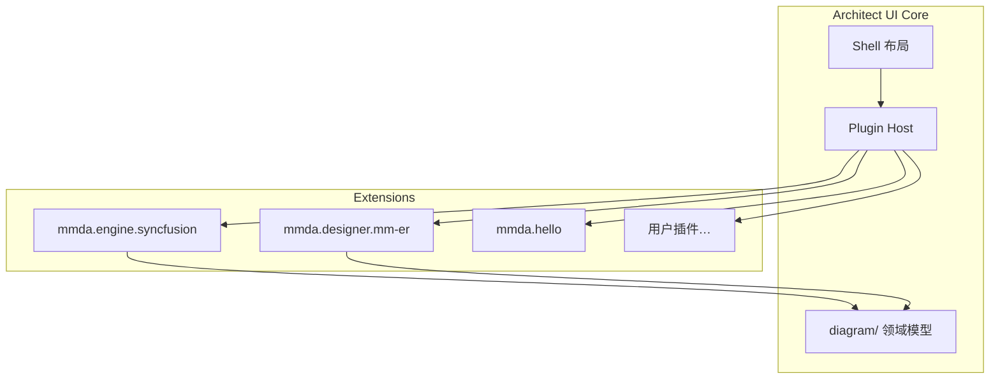

# 插件开发

> 版本 0.1 · Plugin API `0.1.0`

MMDA-Architect 支持通过 **插件（Plugin）** 扩展壳层能力，无需修改核心仓库。内置 Syncfusion 绘图适配器本身也以插件形式注册。

## 1. 架构概览



| 层 | 路径 | 职责 |
|----|------|------|
| **Plugin API** | `apps/architect-ui/src/plugin/` | 类型、注册表、生命周期 |
| **Diagram 模型** | `apps/architect-ui/src/diagram/` | 与厂商无关的 `DiagramDocument` |
| **Diagram 适配器** | `diagram/adapters/*` | 将模型渲染到具体引擎 |
| **内置插件** | `apps/architect-ui/src/plugins/` | 随应用打包的参考实现 |

## 2. 插件清单（Manifest）

```ts
import type { MmdaPlugin } from '@/plugin/types'

export default {
  manifest: {
    id: 'com.example.my-plugin',      // 全局唯一，建议反向域名
    name: 'My Plugin',
    version: '1.0.0',
    description: '…',
    author: '…',
    engine: '0.1.x',                  // 兼容的 Plugin API 版本
  },
  activate(ctx) { /* … */ },
  deactivate() { /* 可选 */ },
} satisfies MmdaPlugin
```

## 3. 扩展点（Contributions）

在 `activate(ctx)` 中调用 `ctx.registerContributions({ … })`：

| 扩展点 | 用途 |
|--------|------|
| `navigatorSections` | 架构导航树新增分区或节点 |
| `workflowStageActions` | 工作流操作条增加按钮 |
| `activities` | 活动栏新图标 + 侧栏 Vue 组件 |
| `diagramAdapters` | 注册绘图**引擎**（见 [diagram-adapters.md](diagram-adapters.md)） |
| `graphDesigners` | （API 0.2）注册 **Graph 设计器**，绑定 `.ma`/`.mm`/`.ms`/`.mf` 与 `{SSOT}.g` |
| `commands` | 命名命令，可通过 `ctx.executeCommand('pluginId.commandId')` 调用 |

### 3.1 运行时上下文 `PluginRuntimeContext`

| 成员 | 说明 |
|------|------|
| `manifest` | 当前插件清单 |
| `notify(message, level?)` | 宿主通知（toast / 状态栏） |
| `registerContributions(c)` | 注册扩展；返回 dispose 函数 |
| `executeCommand(id)` | 执行已注册命令 |

Phase 2 将暴露：`openTab`、`readProjectFile`、校验钩子、Codegen 钩子等。

## 4. 快速开始

参考内置演示插件 [`apps/architect-ui/src/plugins/hello/`](../apps/architect-ui/src/plugins/hello/index.ts)：

1. 在 `src/plugins/my-plugin/index.ts` 导出 `MmdaPlugin`
2. 在 [`plugin/index.ts`](../apps/architect-ui/src/plugin/index.ts) 的 `BUILTIN_PLUGINS` 数组中 import（开发期）
3. 运行 `pnpm dev:ui`，在活动栏可见 🧩 图标

演示插件贡献：

- 导航树分区「插件示例」（位于交互设计之后）
- 项目步骤操作条按钮「插件问候」
- 活动栏侧栏 `HelloPanel.vue`
- 命令 `mmda.hello.greet`

## 5. 注册与加载

当前（Phase 1）：

- 内置插件在 `initPlugins()` 中静态 import
- `main.ts` 在 `mount` 前 `await initPlugins(app)`

计划（Phase 2）：

- 项目 `manifest.json` 或 `.mmdax` 内声明 `plugins[]`
- Tauri / VS Code Host 从工作区或 npm 包动态加载
- `import.meta.glob` 或 sandbox iframe 隔离

## 6. Diagram 适配器插件

绘图不直接依赖 Syncfusion。核心只认 **`DiagramDocument`**（`diagram/model.ts`）。

适配器插件注册 Vue 组件，props 为：

```ts
interface DiagramAdapterProps {
  document: DiagramDocument
  title: string
  options?: { readonly?: boolean; theme?: 'light' | 'dark' }
}
```

内置 `mmda.syncfusion-diagram` 将 `DiagramDocument` 映射为 Syncfusion JSON（`diagram/adapters/syncfusion/map.ts`）。

切换引擎：注册另一个 `diagramAdapters` 条目并设置更低的 `priority`（数字越小越优先）。

## 7. 约定与限制

- **插件 id** 必须稳定，勿与核心分区 id 冲突（建议 `com.vendor.name`）
- **navigator** 节点 id 建议前缀 `plugin-{pluginId}-`
- **workflowStageActions** 的 `id` 在插件内唯一
- **activities** 的 `id` 在插件内唯一；活动栏完整 id 为 `plugin:{pluginId}:{activityId}`
- 插件不得直接修改 Pinia store 内部状态；应通过后续 API 扩展

## 8. 相关文档

- [diagram-adapters.md](diagram-adapters.md) — 图模型与适配器详解
- [ui-shell.md](ui-shell.md) — 壳层布局
- [i18n.md](i18n.md) — 文案与 `titleKey` / `labelKey`
