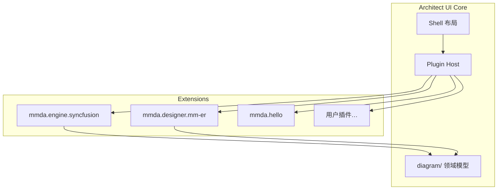

# 插件开发

> 版本 0.2 · Plugin API `0.1.0`
> 本文 0.2 增补：**设计阶段原生支持（§8）**、**插件市场（§9）**、**扩展点规划（§10）**、**权限与硬边界（§11）**、**加载形态（§12，待裁）**——灵感与裁决见 [`../vision.md`](../vision.md) §2 共赢 / §8-5。
> ⚠️ **本文讲的是设计器 / IDE 侧插件（次）**。插件的**主形态是业务功能模块插件**（用户自研业务功能模块，随平台装载）——真源见 [`../runtime.md`](../runtime.md) **§7**。作者口径（原话）：「我说的插件是支持用户自己开发业务功能模块，**至于 IDE 插件对他们没那么重要，支持更好**」。

MMDA-Architect 支持通过 **插件（Plugin）** 扩展壳层能力，无需修改核心仓库。内置 Syncfusion 绘图适配器本身也以插件形式注册。

## 1. 架构概览



| 层 | 路径 | 职责 |
|----|------|------|
| **Plugin API** | `apps/architect-ui/src/plugin/` | 类型、注册表、生命周期 |
| **Diagram 模型** | `apps/architect-ui/src/diagram/` | 与厂商无关的 `DiagramDocument` |
| **Diagram 适配器** | `diagram/adapters/*` | 将模型渲染到具体引擎 |
| **内置插件** | `apps/architect-ui/src/plugins/` | 随应用打包的参考实现 |
| **插件来源** | 内置 / 市场 / 企业私有 registry | 三者走**同一条注册路径**（§9.2），不存在特权通道（§8 判据 3） |

## 2. 插件清单（Manifest）

```ts
import type { MmdaPlugin } from '@/plugin/types'

export default {
  manifest: {
    id: 'com.example.my-plugin',      // 全局唯一，建议反向域名
    name: 'My Plugin',
    version: '1.0.0',
    description: '…',
    author: '…',
    engine: '0.1.x',                  // 兼容的 Plugin API 版本
  },
  activate(ctx) { /* … */ },
  deactivate() { /* 可选 */ },
} satisfies MmdaPlugin
```

## 3. 扩展点（Contributions）

在 `activate(ctx)` 中调用 `ctx.registerContributions({ … })`：

| 扩展点 | 用途 |
|--------|------|
| `navigatorSections` | 架构导航树新增分区或节点 |
| `workflowStageActions` | 工作流操作条增加按钮 |
| `activities` | 活动栏新图标 + 侧栏 Vue 组件 |
| `diagramAdapters` | 注册绘图**引擎**（见 [diagram-adapters.md](diagram-adapters.md)） |
| `graphDesigners` | （API 0.2）注册 **Graph 设计器**，绑定 `.ma`/`.mm`/`.ms`/`.mf`/`.mb` 与 `{SSOT}.g` |
| `commands` | 命名命令，可通过 `ctx.executeCommand('pluginId.commandId')` 调用 |

### 3.1 运行时上下文 `PluginRuntimeContext`

| 成员 | 说明 |
|------|------|
| `manifest` | 当前插件清单 |
| `notify(message, level?)` | 宿主通知（toast / 状态栏） |
| `registerContributions(c)` | 注册扩展；返回 dispose 函数 |
| `executeCommand(id)` | 执行已注册命令 |

Phase 2 将暴露：`openTab`、`readProjectFile`、校验钩子、Codegen 钩子等。

## 4. 快速开始

参考内置演示插件 [`apps/architect-ui/src/plugins/hello/`](../apps/architect-ui/src/plugins/hello/index.ts)：

1. 在 `src/plugins/my-plugin/index.ts` 导出 `MmdaPlugin`
2. 在 [`plugin/index.ts`](../apps/architect-ui/src/plugin/index.ts) 的 `BUILTIN_PLUGINS` 数组中 import（开发期）
3. 运行 `pnpm dev:ui`，在活动栏可见 🧩 图标

演示插件贡献：

- 导航树分区「插件示例」（位于交互设计之后）
- 项目步骤操作条按钮「插件问候」
- 活动栏侧栏 `HelloPanel.vue`
- 命令 `mmda.hello.greet`

## 5. 注册与加载

当前（Phase 1）：

- 内置插件在 `initPlugins()` 中静态 import
- `main.ts` 在 `mount` 前 `await initPlugins(app)`

计划（Phase 2）：

- 项目 `manifest.json` 或 `.mmdax` 内声明 `plugins[]`
- Tauri / VS Code Host 从工作区或 npm 包动态加载
- `import.meta.glob` 或 sandbox iframe 隔离

## 6. Diagram 适配器插件

绘图不直接依赖 Syncfusion。核心只认 **`DiagramDocument`**（`diagram/model.ts`）。

适配器插件注册 Vue 组件，props 为：

```ts
interface DiagramAdapterProps {
  document: DiagramDocument
  title: string
  options?: { readonly?: boolean; theme?: 'light' | 'dark' }
}
```

内置 `mmda.syncfusion-diagram` 将 `DiagramDocument` 映射为 Syncfusion JSON（`diagram/adapters/syncfusion/map.ts`）。

切换引擎：注册另一个 `diagramAdapters` 条目并设置更低的 `priority`（数字越小越优先）。

## 7. 约定与限制

- **插件 id** 必须稳定，勿与核心分区 id 冲突（建议 `com.vendor.name`）
- **navigator** 节点 id 建议前缀 `plugin-{pluginId}-`
- **workflowStageActions** 的 `id` 在插件内唯一
- **activities** 的 `id` 在插件内唯一；活动栏完整 id 为 `plugin:{pluginId}:{activityId}`
- 插件不得直接修改 Pinia store 内部状态；应通过后续 API 扩展

## 8. 设计阶段原生支持（✔ 2026-09-24 已裁）

> 本节讲**设计器侧**的「原生」；**业务功能模块插件**（主形态）的原生支持见 [`../runtime.md`](../runtime.md) §7.5 与 §8 判据 1/2（`*.mmda` 里声明 `plugins[]`、扩展点在设计阶段即存在）。

**作者口径（原话，2026-09-24）**：「**共赢做插件市场，留这个口子，设计阶段原生支持插件式开发**」。

「原生」不是一个形容词，落成**五条可检判据**：

| # | 判据 | 落地方式 |
| --- | --- | --- |
| 1 | **插件清单进项目真源** | `*.mmda` 项目清单里声明 `plugins[]`（id + 版本范围），随 git 一起版本控制、随模型一起评审——**不是本地 IDE 偏好、不是用户级设置** |
| 2 | **扩展点在设计阶段就存在** | 设计器（Tauri 壳）在设计 / 建模阶段即暴露扩展点（§3 + §10）；不是编码期才挂上去 |
| 3 | **内置与第三方同路径** | 内置 `mmda.syncfusion-diagram` 本身就是一个插件（现状事实）；第三方必须能做到内置能做的一切，**没有特权通道** |
| 4 | **插件产物进追溯链** | 插件产出与元数据产物同样进 `REQ → 模型 → 用例 → 生成物 → 运行指标` 追溯链（[`../quality.md`](../quality.md) §5）；插件是产出方之一，不是法外之地 |
| 5 | **离线可用** | 内网不依赖公网市场：私有 registry + 离线插件包可装可验（与国产化离线交付同口径，[`../vision.md`](../vision.md) §5.2.1-⑤） |

**不原生的一条（硬边界）**：**语言层不出现插件 / 市场概念**——`*.ma` / `*.mm` / `*.ms` 里没有 `plugin` 关键字、没有市场声明。判据不变（[`../api.md`](../api.md) §1.1）：**插件是工具与内核的扩展点，不是语言构造**。

## 9. 插件市场（✔ 2026-09-24 已裁：做市场）

### 9.1 定位（共赢的机制）

插件市场同时是三件东西（**市场主力是业务功能模块插件**，见 [`../runtime.md`](../runtime.md) §7；本节机制对两类插件共用）：

1. **第三方扩展的分发渠道**——「第三方能扩展而不被平台锁定」（[`../vision.md`](../vision.md) §2）；
2. **闭源增值内容的分发渠道**——算法库 / 行业业务包 / 模板通过市场分发，**与 open core 边界一致**（契约与内核开源、增值内容闭源但可插，[`../protection.md`](../protection.md) §7.1）。这是「开源换生态、闭源保收益」的收口处；
3. **伙伴体系的载体**——认证伙伴、行业服务商的分级放到市场里表达。

### 9.2 市场形态（三种 registry，同一套协议）

| registry | 谁用 | 形态 |
| --- | --- | --- |
| **公共市场** | 第三方发布者 | 中心 registry（公网） |
| **企业私有市场** | 客户 / 实施方 / 内网 | 内网 registry，或**离线目录**（`plugins/` + 清单文件）；离线可用是硬要求（§8 判据 5） |
| **内置** | 官方 | 随壳打包（`BUILTIN_PLUGINS`），走同一注册路径 |

### 9.3 清单增补字段（在 §2 之上）

```ts
manifest: {
  id, name, version, description, author,
  engine: '0.1.x',                    // Plugin API 兼容范围
  kernel: '>=0.3 <1.0',               // 内核（CLI / IR 版本）兼容范围；不匹配则内核拒载
  targets: ['designer'],              // 'designer' | 'kernel'（§12 待裁，首版只开 designer）
  capabilities: ['artifact:read', 'model:read', 'report:write'], // 最小权限（§11.1）
  publisher: 'com.vendor',
  signature: '…',                     // 发布者签名（§9.5）
  license: 'oss' | 'commercial',      // 市场展示与将来计费用；不改插件 API 即可加计费
}
```

### 9.4 上架、审核与兼容

- **上架三关**：① 清单与签名校验（`mmda plugin verify`，含 id 占用与版本单调）；② **权限声明审查**（最小权限，超出声明即装不上）；③ 危险能力（`fs:workspace` / `net` / `shell`）需人工审核并在市场页显式标注。
- **兼容矩阵**：市场展示「插件 × 内核 / 壳版本」的兼容结论；内核侧 `mmda plugin check` **可离线算**；**不兼容必须拒载并给可行动的提示**（升级壳 / 装旧版插件），不许静默失败。
- **商业条款未定**（分成比例、伙伴分级、认证伙伴）——属商业决策，不进技术契约。技术侧只保证：清单里已有 `publisher` / `license` / `signature`，将来加计费与授权**不需要改插件 API**。

### 9.5 签名与信任链

- **三级签名**：官方（内置与官方插件）／发布者（公共市场）／企业私有（内网，可对接企业 PKI）。
- **校验时机**：安装、升级、每次加载（缓存校验结果）；签名不匹配 → **拒载 + 审计日志**。
- 与算法保护咬合：闭源算法 / 行业包插件同样走**签名 + 许可绑定**（在线激活 / 离线授权，[`../protection.md`](../protection.md) §6–§7）。

## 10. 扩展点规划（设计阶段原生）

§3 的六类之外，设计阶段原生要补齐的扩展点：

| 扩展点 | 用途 | 生命阶段 |
| --- | --- | --- |
| `validationRules` | 附加校验（**只出告警 / 建议**，见 §11.2） | 设计 |
| `importers` / `exporters` | 导入导出（YApi / Apifox / Swagger **只作消费者**；BPMN 互转；Excel 词条） | 设计 |
| `reportPanels` | 报告与看板面板（质量雷达、影响面、对账） | 设计 + 运维 |
| `templatePackages` | 行业模板 / 片段包（`*.mmda` 片段） | 设计 |
| `codegenHooks` | 生成物后处理（**不改写 KEEP 区**） | 编码 |
| `stageActions` | 全生命周期八阶段的阶段动作（[`specification.md`](specification.md)） | 全阶段 |
| `kernelBackends` | 生成后端 / DDL 方言 / 报告输出（**内核侧，形态见 §12 待裁**） | 编码 |
| `journeyViews` | **只读「旅程视图」**（服务设计的多触点旅程图）——**展示面，不进真源、不改语言层**（✔ 2026-09-24 裁决，见 [`../ux.md`](../ux.md) §7） | 设计 |

## 11. 权限与硬边界（**可执行，不靠自觉**）

### 11.1 权限（最小权限，安装时展示，超出即拦）

| 权限 | 含义 |
| --- | --- |
| `model:read` | 读元数据 / 模型（**只读**） |
| `artifact:read` | 读产物（OpenAPI / `MetaUi` / DDL / IR 快照） |
| `report:write` | 写**报告**（对账报告、告警清单）到指定输出目录 |
| `fs:workspace` | 写工作区文件——**默认关闭**，危险能力，需人工审核 |
| `net` | 访问网络——**默认关闭** |
| `shell` | 起子进程——**默认关闭**；内核侧插件必需，故 §12 的形态选择要按隔离能力挑 |

### 11.2 硬边界（内核强制，不靠插件自觉）

1. **禁写语言文件**：插件 API **不提供**写 `*.ma` / `*.mm` / `*.ms` / `*.mf` / `*.mb` 等语言文件的能力；即使给了 `fs:workspace`，内核也**按后缀拒绝**（写失败 + 审计）。这对应早先已裁的「插件只读产物 + 报对账，禁写语言文件」。
2. **不改语言语义**：插件的 `validationRules` 只出 `warning` / `suggestion`，**不许 fail 构建**；要进硬门禁必须由**内核收录为规则**（[`../quality.md`](../quality.md) 的 A/B/C/D 可判定性分级只按内核规则算）。
3. **不进语法**：语言层没有插件 / 市场关键字（§8 硬边界）。
4. **工具概念与语言概念互不渗透**：插件不得要求语言新增概念来表达自己的功能（判据同 [`../api.md`](../api.md) §1.1）。

### 11.3 状态

§11.2 的四条是**已裁的边界**（沿用「插件只读产物 + 报对账」裁决）；§11.1 权限清单的**具体粒度**在实现时细化，但「默认关闭 + 声明式 + 超出即拦」的原则已定。

## 12. 插件加载形态（⏳ 待裁）

**现状**：Phase 1 静态 import（§5）；Phase 2 计划动态加载。

**首版的主力**：**业务功能模块插件**（`jar` / `dll` / npm，**随平台装载**，真源 [`../runtime.md`](../runtime.md) §7——**这才是作者要的那个插件**；装载点落在 P4）。

**设计器插件**（TS / Vue，跑在壳的扩展宿主里）：**支持更好、不做首版承诺**（作者口径：「IDE 插件对他们没那么重要」）；机制沿用现状（静态 import → 动态加载延后）。

**留的口子**：**内核侧插件**（生成后端 / DDL 方言 / 报告输出）。形态三选：

| | 方案 | 优点 | 代价 |
| --- | --- | --- | --- |
| **A（推荐）** | **sidecar 子进程 + JSON-RPC over stdio** | **语言无关**（Rust / Go / Python / Node 都能写）；天然进程隔离，插件崩了不带走内核；与 CLI 工具面复用同一协议 | 进程开销；要定协议、超时与取消语义 |
| B | **WASM（wasmtime + component model）** | 沙箱最强、确定性、可跨平台分发 | 只能用能编 WASM 的语言；文件 / 网络要靠 host 函数暴露；与既有「WASM 只放校验 / 换算 / 预览」口径需放宽 |
| C | **Rust dylib 动态加载** | 最快、零序列化 | **Rust 没有稳定 ABI**——插件必须与内核同编译器版本，跨版本必炸；**不建议对第三方开放**（只可作官方内置扩展的实现方式） |

**我的建议 = A**（`shell` 权限正是留给它）；C 仅用于**官方内置**扩展，不对外。此项待裁，落点见 [`../errata.md`](../errata.md) §三。

## 13. 相关文档

- [diagram-adapters.md](diagram-adapters.md) — 图模型与适配器详解
- [ui-shell.md](ui-shell.md) — 壳层布局
- [i18n.md](i18n.md) — 文案与 `titleKey` / `labelKey`
