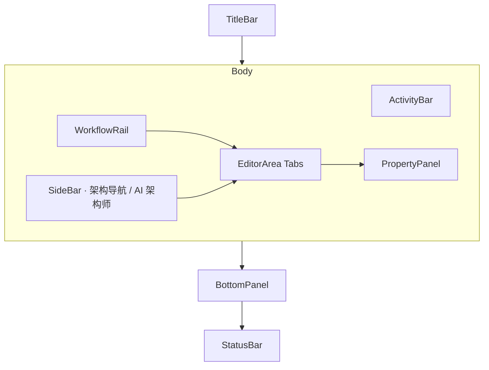

# MMDA Architect UI Shell

> 版本 0.1 · 布局框架

## 1. 目标

为软件架构师提供 **IDE 式设计工作台**：在同一界面完成功能分解、元模型设计（图 + Lang）、存储与 Codegen 配置、生成与原型预览。

UI 需满足：

1. **独立桌面应用**（Tauri 壳 + 本包 `dist/`）
2. **VS Code 扩展**（Webview 嵌入 + `HostContext` 桥接）
3. **IntelliJ 插件**（JCEF Webview，同一套 Host 协议）

**SSOT 不在 UI 内**：所有设计资产仍在 MMDA 项目（工作区 / `.mmdax`），由 `mmda-core` / CLI 校验与持久化。

## 2. 布局总览



### 2.1 六步工作流（WorkflowRail）

与 [workflow.md](workflow.md) 对齐：

| 步骤 | 架构师活动 | 主要视图 |
|------|------------|----------|
| 1 项目 | 新建 / 打开 / 打包 | 欢迎页、manifest |
| 2 业务架构 | 菜单树、功能架构图 | 架构导航 · 业务架构、modules |
| 3 数据架构 | Record / Enum / E-R | 导航 · 数据架构、Lang、E-R Tab |
| 4 流程架构 | 角色权限 → STM、DFD、BPMN | 导航 · 流程架构（角色权限为首项） |
| 5 交互设计 | 定制视图、Module ui | 导航 · 交互设计（Phase 2） |
| 6 交付 | validate / generate / 原型 | Codegen Profile、输出面板 |

### 2.2 架构导航树（Explorer）

左侧 **架构导航**（非文件树）按设计域分区，与 `mmda-workflow.md` 设计笔记一致：

| 分区 | 内容 |
|------|------|
| 业务架构 | Module 树、功能架构图入口 |
| 数据架构 | 枚举、对象、E-R |
| 流程架构 | 角色权限、Converter / DFD、STM、BPMN |
| 交互设计 | 定制视图（Phase 2） |
| 交付 | codegen/profiles |

点击节点打开对应 Tab，并在 **属性面板** 编辑 Module / Record 元数据。

### 2.3 活动栏与可停靠面板

**架构导航**与 **AI 架构师** 为独立停靠面板，可分别置于左侧或右侧，并同时显示（例如导航左、AI 右）。同侧并存时使用标签页切换。

| 入口 | 说明 |
|------|------|
| 活动栏 📁 / ✦ | 开关架构导航 / AI 面板 |
| 面板标题栏 ⇄ | 循环切换停靠位（AI：左 → 右 → 与属性合并） |
| 面板标题栏 ⠿ 拖拽 | 拖到左/右/属性区释放 |
| 视图 → AI 架构师 · 与属性合并 | 属性列内 Tab 切换 |
| 视图 → 面板布局 → AI 与属性 | 预设：导航左 + 属性/AI 标签 |
| 状态栏「布局」 | 点击循环切换预设（含 AI+属性） |

**快捷键**（见 视图 → 快捷键）：

| 快捷键 | 作用 |
|--------|------|
| Ctrl+Shift+E | 开关架构导航 |
| Ctrl+Shift+A | 开关 AI 架构师 |
| Ctrl+Shift+L | 循环布局预设 |
| Ctrl+Alt+P | 聚焦属性列 / 属性 Tab |
| Ctrl+Alt+A | 打开 AI / 切换到 AI Tab |

布局与宽度写入 `localStorage`（`mmda-dock-layout`、`mmda-panel-sizes`）。

其余活动（设计图、搜索、运行）仍使用左侧活动侧栏，与停靠面板并列显示。

| 图标区 | 内容 |
|--------|------|
| 架构导航 | 业务 / 数据 / 流程架构 / 交互设计 分区树（可停靠左/右） |
| 设计图 | E-R / STM / DFD 入口 |
| 搜索 | 全项目符号搜索（Phase 2） |
| 运行 | 生成、校验、启动原型 |
| AI | AI 架构师对话（可停靠左/右；Phase 1 本地演示，Phase 2 MCP） |

### 2.4 编辑区（EditorArea）

多 Tab 并存，典型组合：

- `E-R · mes` — 实体关系图（**Syncfusion Diagram** 接入点，当前为占位画布）
- `STM · Bom` — 状态机图，绑定 `mes.Bom`
- `Bom.mmda` — Monaco 编辑 M语言

图形与 M语言 **双向同步**规则见 [diagrams.md](diagrams.md)。

## 3. Host 抽象（插件化关键）

UI 不直接读写磁盘，而通过 `HostContext`：

```typescript
interface HostContext {
  mode: 'web' | 'tauri' | 'vscode' | 'idea'
  openProject(): Promise<string | null>
  readText(path: string): Promise<string>
  writeText(path: string, content: string): Promise<void>
  runCli(args: string[]): Promise<CommandResult>
  notify(message: string, level?: 'info' | 'warn' | 'error'): void
}
```

| Host | 实现 |
|------|------|
| **web** | 开发演示；内存 mock 项目 |
| **tauri** | `invoke('read_text')` → Rust 调用 `mmda-core` |
| **vscode** | Extension `postMessage` ↔ Webview |
| **idea** | JCEF JavaScript 桥（同 vscode 消息协议） |

代码位置：`apps/architect-ui/src/host/`。

### 3.1 VS Code 扩展（规划）

```
extensions/vscode-architect/
  package.json          # contributes custom editor / webview
  src/extension.ts      # 注册 MMDA 项目根
  media/                # apps/architect-ui/dist
```

Webview 加载 `index.html?host=vscode`；扩展实现 `readText` / `runCli`（调用 `mmda` CLI）。

### 3.2 IntelliJ 插件（规划）

`JBCefBrowser` 加载同一 `dist/index.html?host=idea`；Java 侧实现 Host 协议。

### 3.3 Tauri 独立应用（规划）

```
apps/architect-desktop/
  src-tauri/            # 窗口 + invoke handlers
  引用 architect-ui/dist
```

## 4. 技术栈

| 层 | 选型 |
|----|------|
| 框架 | Vue 3 + TypeScript + Pinia |
| 构建 | Vite |
| 代码编辑 | Monaco Editor |
| 绘图 | **Syncfusion Diagram**（`@syncfusion/ej2-vue-diagrams`） |
| 桌面壳 | Tauri（Phase 2） |
| 引擎 | Rust `mmda-core`（CLI / 未来 Tauri commands） |
| 包管理 | **pnpm workspace**（根目录 `pnpm install`） |

## 5. 目录

```
apps/architect-ui/
  src/
    host/           # HostContext 与各宿主
    diagram/        # DiagramDocument 领域模型与适配器注册
    plugin/         # 插件 API 与 initPlugins
    plugins/        # 内置插件（syncfusion-diagram、hello）
    layouts/        # ArchitectShell
    components/
      shell/        # 布局分区组件
      editors/      # DiagramCanvas、CodeEditorPane
    stores/         # project、layout、theme、locale
    i18n/           # vue-i18n 文案与 composables
    views/          # Welcome
```

## 6. 实现状态

| 能力 | 状态 |
|------|------|
| IDE 布局骨架 | ✓ |
| 六步工作流导航 | ✓ |
| 项目树 / 多 Tab | ✓ |
| Monaco M语言 编辑 | ✓ |
| Syncfusion E-R / STM 图 | ✓（演示数据；SSOT 同步 Phase 2） |
| Diagram 领域模型 + 适配器抽象 | ✓ |
| 插件 API（导航 / AI / 活动栏 / 命令；workflowStageActions 已弃用） | ✓（内置 hello 演示） |
| 项目 manifest 动态加载插件 | Phase 2 |
| 深色 / 浅色 / 跟随系统 | ✓ |
| Shell i18n（zh-CN / en / zh-Hant） | ✓ |
| Tauri / VS Code / IDEA Host | 协议 + web 实现；宿主待接 |
| Syncfusion 真图编辑 | Phase 2 |
| 与 mmda-core 实时校验 | Phase 2 |

## 7. 相关文档

- [specification.md](specification.md)
- [project-format.md](../project.md)
- [plugins.md](plugins.md)
- [diagram-adapters.md](diagram-adapters.md)
