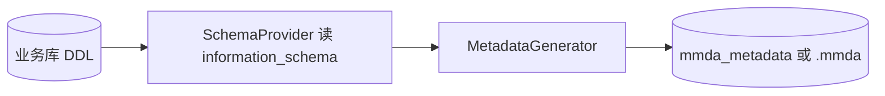

# 从 DDL COMMENT 导入（Legacy）

> 补充说明。新规范主路径为直接编写 [M语言](../records.md) 或 Architect 建模。

Java `MetadataGenerator` 从 `information_schema` 读取表/列注释，生成 MetaObject/MetaCol。Architect 规划命令：`mmda import --from-ddl`。

## 表 COMMENT

```
COMMENT='@Department 部门。部门及分支机构，包括加盟公司'
```

| 部分 | 规则 |
|------|------|
| `@ObjectName` | Record 名（PascalCase；MySQL 表名不区分大小写时需 `@` 前缀） |
| 中文名称 | 默认 `label` |
| 句号后 | 备注 / description |

## 字段 COMMENT

```
'中文标签：修饰符与 DSL'
```

| 标记 | 含义 |
|------|------|
| **PK** | partitionKey（分区键；常与 SQL 主键同列，**不是** PRIMARY KEY 的同义词） |
| **UK** | uniqueKey（租户内唯一） |

### 嵌入 DSL

```
性别：0;UNKNOWN;-|1;MALE;男|2;FEMALE;女
职称：REF TechnicalTitle(titleID,titleName,superTitleID)
工作部门：HAS_ONE Department(deptID,deptName,parentDeptID) AS workDepartment WHERE(status>0)
```

| DSL | 说明 |
|-----|------|
| ENUM in comment | `MetaEnum` + `enumSet = ENUM Gender` |
| HAS_ONE … AS x | 导航属性名 + 可选 WHERE |
| REF | 小表、可缓存，不加载整实体 |

与 [meta-model.md](../meta-model.md) 中 FieldRef 语法一致。

## 多租户 ID（Legacy 运行时）

- 表必须有主键；多租户时主键宜为 **BIGINT**
- partitionKey：高 16 位 tenant id，低 48 位实体 id **（⚠️ 旧口径，已废 —— 现为高 28 位 tenantId（27 位有效）+ 低 36 位 realId，见 [`../records.md`](../records.md) §2.3）**
- 未表分区时可用 `id BETWEEN min AND max` 隔离租户
- 应为 uniqueKey 建索引

## 计算列

```sql
`deptCodeName` VARCHAR(50) AS (concat(`deptCode`,' ',`deptName`)) STORED COMMENT '部门全称',
```

→ Field：`computed` + `formula`

## 逆向流程



新规范目标：`mmda import --from-ddl` → 直接写入 `.mmda` 项目，而非依赖独立元库。

## 与 M语言 互转

| COMMENT DSL | M语言 |
|-------------|-----------|
| ENUM in comment | `field Type enum EnumName` |
| HAS_ONE … AS x | `fieldId type ref Entity as x` |
| REF … | `fieldId type ref Entity` |
| 表 @Employee | `record Employee` |

## 相关

- [java-factory.md](java-factory.md) — `mmda meta` 命令
